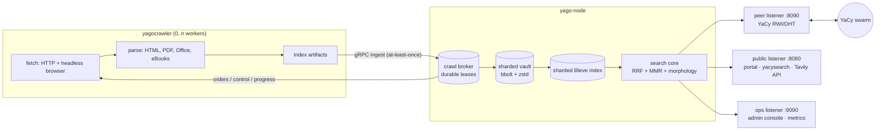

# YagoSeek

<p align="center"><b>Your own federated search engine — one Go binary away.</b></p>

<p align="center">
  
  
  
  
  
</p>

**YagoSeek** is a self-hosted, YaCy-compatible peer-to-peer search node written
in pure Go: run your own web index, join the federated YaCy swarm, crawl the
web with a hardened crawler, and query everything through a Tavily-compatible
Search API, YaCy-compatible endpoints, or a themeable public portal — all
administered from a server-rendered console that works without JavaScript.

**YagoSeek** is the product; **`yago`** is the toolkit — the Go workspace and
its binaries (`yago-node`, `yagocrawler`).

- Project home: https://yagoseek.dev/ · docs: https://docs.yagoseek.dev/
- Source: https://github.com/D4rk4/yago/ — importable as `github.com/D4rk4/yago`

> [!WARNING]
> **Alpha software.** Everything described below is implemented, covered by
> tests (unit, integration, and containerized end-to-end suites), and runs on
> real nodes — but the project is young and still needs broad, adversarial,
> real-world testing before you should trust it with anything critical.
> Expect rough edges, please report what you hit, and keep backups (there is
> a console page for that now).

---

## ✨ What you get

### 🌐 A real YaCy peer

- Speaks the **YaCy RWI/DHT wire protocol**: hello handshake, seed lists
  (HTML/JSON/XML), inbound and outbound RWI/URL-metadata DHT transfers with
  sender-side gates, remote RWI search, host-link index, peer messages,
  profiles, and shared blacklists — interoperable with the Java YaCy network.
- **Swarm participation**: seedlist bootstrap, peer roster with birth-date
  promotion, LAN discovery, peer news, per-peer blocking, and a DHT gates
  dashboard showing exactly why a transfer would or would not fire.
- Deliberate divergences are documented, not hidden — see
  [compatibility.md](yagonode/doc/compatibility.md).

### 🔍 Search that ranks, not just matches

- Local index (sharded [Bleve](https://blevesearch.com/)) + federated swarm
  fan-out + optional operator-enabled web fallback after a miss. The provider is
  off by default, and local-only requests never reach it. Results are merged with
  **reciprocal-rank fusion** and **MMR result diversity**.
- **[YagoRank](yagonode/doc/yagorank.md)** — strict and relaxed fielded BM25,
  bounded lexical evidence and RM3, deterministic peer RRF, persistent date,
  anchor, authority, quality, safety, duplicate-cluster, and reputation signals,
  followed by a signed linear LambdaRank or bounded histogram LambdaMART model.
  Query-clustered and chronological holdouts gate atomic promotion; authenticated
  Team Draft compares complete rankings online, while confidence-filtered
  FairPairs outcomes provide implicit relevance evidence.
  Pure Go, CPU-only, no external API, sidecar, model runtime, or YaCy wire change.
- **Multilingual morphology**: documents route to per-language analyzers
  (Snowball stemming), single-word swarm queries can expand into
  corpus-observed inflections, and zero-result typo recovery uses bounded
  analyzer-consistent edit distance without document-wide character grams.
- YaCy query operators (`site:`, `inurl:`, `filetype:`, `language:`, `tld:`,
  `author:`, `"phrase"`, `-not`, `near`, `/date`), facet sidebar, content
  verticals (images/audio/video/apps with a lightbox grid), spell-check
  ("did you mean"), zero-result fuzzy recovery, query-term-highlighted
  snippets, anchor-text document expansion, and an explainable ranking API.
  Local and swarm retrieval use parsed bare terms; an eligible web fallback
  receives the bounded original operator-bearing query and verifies supported
  structured constraints again on returned rows.
  Quoted phrases prefer locally stored candidates whose analyzer-normalized words
  are adjacent; they do not exclude other all-term matches.
- **Tavily-compatible `/search`, `/extract`, `/crawl`, and `/map`** with API
  keys and scopes. Raw-content work has fixed concurrency, time, fetch, and
  response-memory budgets, while ordinary search stays on the low-cost path.

### 🕷️ A crawler built for the hostile web

- Separate `yagocrawler` worker(s) connected over gRPC with durable leased
  orders, absolute-tally progress reports, and backpressured at-least-once
  ingest — restart anything, lose nothing.
- **Format coverage beyond HTML**: PDF, DOCX/XLSX/PPTX, legacy DOC/XLS/PPT,
  ODT/ODS/ODP, RTF, EPUB, plain text/CSV/Markdown — parsed with stdlib-first
  parsers and validated against real files.
- **Two-tier fetching**: fast HTTP first, headless-browser fallback (headless
  Firefox over Marionette, one long-lived process) for bot-walled and
  JavaScript-rendered pages, both behind a dial-time SSRF egress guard;
  per-profile toggles for robots, TLS authority, and browser use.
- **Legacy-web text correctness**: browser-compatible charset decoding handles
  Windows-1251 and other WHATWG encodings, while bounded content-language
  detection keeps documents, facets, RWI postings, and URL metadata aligned.
- **Bounded search memory**: spelling and morphology retain fixed-size
  frequent-term summaries; candidate scans avoid full document bodies; peer and
  web responses, index results, paging sessions, background cache writes, and
  host-link snapshots have process-wide byte or admission limits. `/metrics`
  exposes Go heap plus process RSS for pre-OOM alerts.
- Politeness and defense: robots.txt with a standards-compliant 500 KiB parsing
  limit and a sanitizer for real-world malformed files, per-host adaptive pacing
  and crawl delays, URL canonicalization,
  persistent near-duplicate clustering, crawl-trap defense, per-host and
  per-run page budgets, boilerplate extraction, and a deterministic
  content-quality gate.
- **A living index**: a default 30-day recrawl cadence refreshes pages, and a
  recrawl that finds a page permanently gone (404/410) tombstones it out of
  the index — no eternal dead links.
- Autocrawler: swarm greedy-learning and web-fallback seeding fill a young
  index automatically, fully tunable from the console.

### 🎨 A public portal your users can keep

- Server-rendered, **works without JavaScript**, accessible (skip links, ARIA,
  keyboard navigation), mobile-friendly, with OpenSearch browser integration
  and RSS/JSON output for every query.
- **Operator-themeable end to end**: the search and results pages are
  Handlebars templates editable from the console — visually with a light
  GrapesJS editor that previews the shared portal CSS, or as code with
  CodeMirror — with one-click return to the built-in design and a fallback
  that keeps a broken template from ever blanking the public surface.

### 🛠️ An admin console with everything in one place

- Server-rendered (htmx-enhanced, no SPA, no CDN — every asset self-hosted),
  with two visual themes and full no-JS degradation.
- Sections: Overview, Search (with suggestions), Activity, Public portal
  (settings + design tabs), Autocrawler, Crawler (dispatch, live monitor,
  pause/resume/rate control, health), Network (peers, seedlists, news,
  blocking), Index (browse, delete, blacklist, export, schema), Performance
  (live tiles **and sampled history sparklines**), Backup & restore,
  Configuration (runtime settings with checkboxes, batch save, per-setting
  reset), Security (Argon2id admin login, session management, scoped API
  keys), Logs (filterable events), Restart (node and crawler fleet, can be
  disabled by config).
- First-run **setup wizard**, CSRF everywhere, strict CSP, login rate
  limiting, and a config-events audit trail.

### 📦 Operations without surprises

- One static binary per role; Docker/Compose on the shared `/opt/yago`
  layout, hardened systemd units, and Debian packages built by a tag-driven
  release pipeline with generated notes.
- Docker builds pin every builder and runtime base by digest. The node and
  crawler images carry OCI source and revision labels when the caller supplies
  `SOURCE_REVISION`, so two images can be traced to the same source commit.
- Prometheus `/metrics` (RED/USE + saturation), burn-rate alert rules with an
  SLO doc, health/readiness endpoints, auth-gated pprof, trace-correlated
  structured logs (never secrets), and a durable event store.
- **Offline backup/restore scripts** for docker and systemd — covered by an
  automated end-to-end round-trip test — plus a console page that shows
  storage usage and hands you the exact commands.
- Storage: a sharded, compressed, quota-bounded vault (bbolt + zstd) where
  losing one shard file loses 1/N of the keyspace, never the store; shard
  integrity checks and index-orphan healing run at startup.
- Outbound traffic is screened in-process at dial time: private networks,
  loopback, link-local, and the cloud metadata range are blocked by default,
  with explicit CIDR allowlists (`YAGO_EGRESS_ALLOW_CIDRS`) when you need
  them.

---

## 🧭 YaCy parity at a glance

The [compatibility matrix](yagonode/doc/compatibility.md) tracks every surface
against upstream YaCy (audited against `yacy/yacy_search_server`):

| Status | Count | Meaning |
| --- | ---: | --- |
| ✅ implemented | 30 | wire-compatible, tested against fixtures captured from Java YaCy |
| 🟡 partial | 5 | interoperable core with documented, by-design divergences |
| ⛔ unsupported | 5 | deliberate non-goals (embedded Solr API ×2, Java admin page clones, removed GSA servlet, MCP/OpenAI AI surfaces) |

Highlights: `hello`, `query`, `transferRWI`, `transferURL`, remote `search`,
seed lists, `idx.json`, `list.html`, `message.html`, `profile.html`,
`urls.xml`, `crawlReceipt`, and the `yacysearch.{json,rss,html}` +
`suggest.{json,xml}` + OpenSearch client surfaces all interoperate with Java
peers. The admin plane is deliberately different (Argon2id sessions plus
scoped API keys instead of digest auth) — plain YaCy *search* clients are
unaffected. Remote crawl for the swarm is answered but disabled by default
([policy](yagonode/doc/remote-crawl-policy.md)).

---

## 🚀 Quick start

Requirements: Docker (or Podman); for source builds, Go 1.26.

```sh
export YAGO_SEARCH_API_KEY='replace-with-a-long-random-secret'
cp docker-compose.yml.example docker-compose.yml
docker compose up -d
```

| Port | Listener | Serves |
| --- | --- | --- |
| `8090` | Peer (P2P) | the YaCy wire protocol (`/yacy/*`) — keep reachable |
| `8080` | Public search | portal, `yacysearch.*`, OpenSearch, Tavily `/search`, `/extract`, `/crawl`, `/map` |
| `9090` | Admin & ops | console, `/health`, `/ready`, `/metrics` |

Open `http://localhost:9090/admin/` — the first-run **setup wizard** creates
the administrator account and walks through the initial settings. Enable the
public portal from the Public portal page when you are ready to serve
visitors.

Try it from the command line:

```sh
curl -fsS 'http://127.0.0.1:8080/yacysearch.json?query=test&resource=local'
curl -fsS -H 'content-type: application/json' \
  -H "authorization: Bearer ${YAGO_SEARCH_API_KEY}" \
  -d '{"query":"test","max_results":5}' http://127.0.0.1:8080/search
```

A bare node needs **no configuration** to start: it generates and persists its
peer identity on first run. The variables you are most likely to touch:

| Variable | Default | Meaning |
| --- | --- | --- |
| `YAGO_DATA_DIR` | `/opt/yago/data` (container) | all persistent state — index, vault, identity |
| `YAGO_SEEDLIST_URLS` | example list | YaCy seedlists to bootstrap the swarm from |
| `YAGO_PUBLIC_ADDR` | `:8080` | public listener; `off` runs a pure peer node |
| `YAGO_PUBLIC_SEARCH_UI_ENABLED` | `false` | serve the portal at the public root |
| `YAGO_CRAWL_RPC_ADDR` | empty | set (e.g. `:9091`) to enable the crawler integration |
| `YAGO_STORAGE_QUOTA` | `1GB` | storage cap; eviction keeps the node inside it |

The full reference — every variable and its default — is
[doc/configuration.md](yagonode/doc/configuration.md). Bare-metal installs get
hardened systemd units and Debian packages under [deploy/](deploy/).

---

## 🏗️ Architecture



| Module | Purpose |
| --- | --- |
| `yagonode` | the peer daemon: protocol endpoints, vaults, search surfaces, portal, admin console, metrics |
| `yagocrawler` | the optional crawler worker: fetch, parse, and emit ingest batches |
| `yagocrawlcontract` | the shared node↔crawler data model and gRPC contract |
| `yagomodel` / `yagoproto` | the YaCy wire model and protocol helpers — reusable on their own |
| `yagoegress` | the shared dial-time SSRF egress guard |

Architecture decisions live in [ADRs](yagonode/doc/adr/README.md), including
the deliberate no-gos; the full feature ledger with
per-feature test pointers is [FEATURES.md](FEATURES.md).

## 🛠️ Development

```sh
make verify   # fmt-check · vet · lint · arch · race tests · exact coverage · build
make e2e      # containerized end-to-end suites (node, crawler, backup/restore)
```

Every feature lands with tests; new third-party dependencies require an ADR
first; `make verify` plus Semgrep and Trivy scans gate every commit. Build and
lint tools are pinned and installed under `.toolchain/` by `make tools`.
Coverage is checked from raw statement totals across all six Go modules; a
self-test proves the checker rejects a profile that display rounding would call
100%. The two isolated testcontainers modules cover the node and crawler. The
crawler suite also exercises the complete YagoRank promotion path with 66
documents across 22 query clusters, split into 1 training, 1 development, and
20 test clusters, and verifies that the promoted model changes the public top
result.

## 📚 Documentation

| Doc | What's inside |
| --- | --- |
| [compatibility.md](yagonode/doc/compatibility.md) | the YaCy parity matrix, endpoint by endpoint |
| [yagorank.md](yagonode/doc/yagorank.md) | the learned ranking stack: model, features, and the tuning loop |
| [configuration.md](yagonode/doc/configuration.md) | every environment variable and its default |
| [specification.md](yagonode/doc/specification.md) | the node's behavior specification |
| [metrics.md](yagonode/doc/metrics.md) · [slo.md](yagonode/doc/slo.md) | observability and alerting |
| [backup-restore.md](yagonode/doc/backup-restore.md) | the offline backup/restore procedure |
| [yacy-dht-interop.md](yagonode/doc/yacy-dht-interop.md) | how DHT transfer selection works |
| [remote-crawl-policy.md](yagonode/doc/remote-crawl-policy.md) | why remote crawl is off by default |
| [ADR index](yagonode/doc/adr/README.md) | every architecture decision, including the no-gos |

## 🤝 Credits

This repository started as a fork of
[nikitakarpei/yacy-rwi-node](https://github.com/nikitakarpei/yacy-rwi-node) by
Nikita Karpei, and owes its interoperability to the
[YaCy](https://yacy.net/) project and its two decades of decentralized search.

## 📄 License

[AGPL-3.0](LICENSE). Searches fan out to peers in the YaCy network, which see
your query terms; the portal footer explains result provenance to your users.
