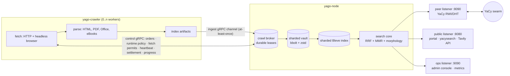

# YagoSeek

<p align="center"><b>Your own federated search engine — one Go binary away.</b></p>

<p align="center">
  
  
  
  
  
</p>

**YagoSeek** is a self-hosted, YaCy-compatible peer-to-peer search node written
in pure Go: run your own web index, join the federated YaCy swarm, crawl the
web with a hardened crawler, and query everything through a Tavily-compatible
Search API, YaCy-compatible endpoints, or a themeable public portal — all
administered from a server-rendered console that works without JavaScript.

**YagoSeek** is the product; **`yago`** is the toolkit — the Go workspace and
its binaries (`yago-node`, `yago-crawler`).

- Project home: https://yagoseek.dev/ · docs: https://docs.yagoseek.dev/
- Source: https://github.com/D4rk4/yago/ — the importable Go modules are listed
  in [`go.work`](go.work)

> [!WARNING]
> **Alpha software.** Everything described below is implemented, covered by
> tests (unit, integration, and containerized end-to-end suites), and runs on
> real nodes — but the project is young and still needs broad, adversarial,
> real-world testing before you should trust it with anything critical.
> Expect rough edges, please report what you hit, and keep backups (there is
> a console page for that now).

---

## ✨ What you get

### 🌐 A real YaCy peer

- Speaks the **YaCy RWI/DHT wire protocol**: hello handshake, seed lists
  (HTML/JSON/XML), inbound and outbound RWI/URL-metadata DHT transfers with
  sender-side gates, remote RWI search, host-link index, peer messages,
  profiles, and shared blacklists — interoperable with the Java YaCy network.
- Stock-Java interoperability is exercised in both directions. A wire handoff
  accepts at most 1,000 rows and returns parseable YaCy HTTP 200 overload
  responses instead of silently acknowledging an unprocessed tail. Remote
  result copies carry the transient `wi` WordReferenceRow evidence required by
  current Java peers, and accepted remote-search resources contribute to the
  advertised received-word and received-URL totals. Inbound RWI and URL
  metadata transfers require the authenticated sender hash to exist in the
  persistent peer roster; an inactive or junior peer remains eligible. Outbound
  selection commits its recovery rows before a separate live-index deletion,
  and restoration commits live rows before releasing those recovery rows.
  A later shard failure therefore leaves a live or restart-recoverable copy
  until every queued redundancy copy is accepted. Per-URL rejection restores
  only the affected postings while unaffected postings complete. A rejected
  redundancy copy is cancelled from
  every sibling target before local restore, and a failed restore or final
  journal confirmation is retried locally before another network handoff.
- **Swarm participation**: seedlist bootstrap, peer roster with birth-date
  promotion, LAN discovery, peer news, per-peer blocking, and the DHT gates
  dashboard showing exactly why a transfer would or would not fire. Authenticated
  inbound hello callers that fail the local callback remain visible as bounded
  `junior` potential peers, but cannot enter reachable membership, search,
  seed-list, or DHT target selection. Callback work uses YaCy's aggregate
  6.5-second HTTP or 13-second HTTPS-first budget across at most five unique
  advertised hosts. Peer transport tries the primary `IP` host first and then
  `IP6` entries in wire order, supports IPv6-only seeds, and promotes the host
  that actually answered before storing the peer. RWI and URL transfer attempts
  divide the existing caller/client deadline across that same bounded address
  order instead of multiplying the timeout per address. Its bounded caller-observation
  write survives request cancellation, so a blackholed endpoint does not erase
  the junior row. Authentication failure and self identity receive a virgin
  response without peer seeds; authenticated responses expose no more than 100
  currently reachable peers in deterministic local last-seen order without a
  persistent-roster scan, and reachable principal callers retain that type.
  Hello keeps `iam` opaque for exact salted authentication; an absent,
  malformed, or signed-int32-overflow `count` uses stock YaCy's zero fallback.
  Configured seedlists share one ten-second, eight-worker refresh and one
  4,096-seed/16-MiB aggregate, preserving completed fast sources at the deadline.
  Served plain seed lists use YaCy's shorter compact `b|` or `z|` row form;
  request counts and version floors follow Java integer and binary32 parsing,
  including the stock fallback for malformed peer versions.
  Peer membership changes use cancellation-aware serialization; transport
  failures retain a durable cooling peer for retry, successful search or greeting
  contact promotes it, and verified exact endpoint ownership prevents an
  unverified duplicate from becoming routable after restart. Primary peer rows
  remain readable by v0.0.20; additive row-and-state-bound lifecycle metadata is
  ignored by that version and falls back conservatively after a downgrade rewrite.
  Validated outbound hello responses retain recent external back-ping
  evidence for truthful public-endpoint status without making inbound
  reachability a prerequisite for outbound RWI distribution. The published
  self type starts virgin, follows the strongest current peer evidence, and
  retains its last value when the current evidence window becomes empty; the
  self seed, seed lists, Admin Overview, and DHT maturity gate share that value.
  The roster excludes the immutable local peer hash at persistence, admission,
  selection, count, and Admin projection boundaries.
- Peer messages enforce the advertised decoded 100-byte subject and 10,240-byte
  body limits and retain a deterministic 1,024-record/8-MiB durable mailbox.
  Peer-news records are limited to 1 KiB, expire after 24 or 72 hours by upstream
  category, and use restart-safe newest-created retention bounded to 4,096 queue
  rows/4 MiB and 4,096 duplicate identities. Startup cleanup is progress-making
  and removes confirmed corrupt, oversized, expired, or orphaned legacy state
  before use. An operational inspection or read failure rolls back the current
  cleanup page instead of treating unread state as corrupt. Earlier committed
  pages remain durable, cleanup resumes from its last durable checkpoint, and a
  pending recovery intent remains available for idempotent reconciliation.
- Deliberate divergences are documented, not hidden — see
  [compatibility.md](yagonode/doc/compatibility.md).

### 🔍 Search that ranks, not just matches

- Local index (sharded [Bleve](https://blevesearch.com/)) + federated swarm
  fan-out + optional operator-enabled web search. The provider is off by default,
  local-only requests never reach it, and the single **Web search fallback
  (DDGS)** selector offers `Disabled`, `Only when requested`, `Enabled on search
  miss`, and `Always`; the last mode starts web retrieval alongside local and
  swarm retrieval. Human-facing surfaces call external results `web`,
  YaCy HTML marks them `[web]`, and Tavily-compatible responses keep their
  standard shape without a provider field. A hyphen or dash inside an ordinary query word
  separates searchable words across local and web retrieval, while a leading
  minus remains an exclusion operator. Web rows always satisfy authoritative URL
  and structured constraints. Requests using `verify=ifexist` additionally
  require bounded visible query evidence; Tavily `basic`, `fast`, and
  `ultra-fast` preserve `verify=false`. When web-discovery seeding is enabled,
  surfaced URLs are admitted to bounded background warming and normalized before
  admission. A one-at-a-time recovery intent protects durable publication, which
  coalesces a normalized URL only while its task is pending or leased.
  Acknowledgement, terminal failure, or cancellation first persists a settlement
  intent; retry or startup finishes any partial lease transition and identity
  release idempotently. A later search can then retry without delaying the
  original response or scheduling a second root fetch while work is active.
  Successful lease-authorized ingest attempts to persist the live lease's
  profile before recording the fetch. A profile or schedule write failure is
  logged and cannot reject or roll back the fetched document.
  Results are
  merged with **reciprocal-rank
  fusion** and **MMR result diversity**. A slow swarm branch cannot discard a
  completed local answer, and a transient refresh cannot replace a recent
  nonempty search session with an infrastructure-generated zero, including when
  the bounded remote-stage admission is full. Completed local, peer, and web
  branches survive a sibling branch's recoverable error or cancellation race.
  An incomplete global request may
  reuse an unexpired equivalent local session without extending its lifetime or
  recording a synthetic global success. Operational search-stage errors retain
  completed rows as a partial answer, and recent paging windows remain readable
  while a deeper page is being extended. Portal navigation links only to the
  materialized result prefix; an explicitly requested page is preserved until
  a complete retrieval proves that it lies beyond the final page.
  A Tavily-compatible search with no rows and at least one incomplete source
  returns HTTP 503 with `Retry-After: 1` while the original caller context
  remains live. A child or source deadline is therefore retryable while that
  caller remains live; inherited caller cancellation or deadline retains the
  existing infrastructure-error path. An honest complete miss remains HTTP 200
  with an empty result list, and completed partial rows remain HTTP 200.
  A strict non-facet candidate pass skips relaxed retrieval only when it fills
  the requested result window and reports further strict rows (`Total > window`);
  this preserves relaxed evidence at the exact pagination boundary.
  Pseudo-relevance feedback skips its second pass once its bounded activation
  window is full.
- **[YagoRank](yagonode/doc/yagorank.md)** — strict and relaxed fielded BM25,
  bounded lexical evidence and RM3, deterministic peer RRF, persistent date,
  anchor, authority, quality, safety, duplicate-cluster, and reputation signals,
  followed by a signed linear LambdaRank or bounded histogram LambdaMART model.
  In a mixed-source result set, learned inference reorders the bounded fused
  top window across local, peer, and web provenance. Each selected document
  inherits its destination slot's bounded relevance scale for final diversity,
  so raw model scores do not compete with the unscored tail.
  Query-clustered and chronological holdouts gate atomic promotion; authenticated
  Team Draft compares complete rankings online, while confidence-filtered
  FairPairs outcomes provide implicit relevance evidence.
  Its console exposes all 13 operator-safe live coefficients: five field boosts,
  authority, freshness, quality, short-URL prior, ordered and unordered
  proximity, lexical blend, and original-gap agreement. Latency windows,
  evidence-confidence rules, safety gates, and learned-model weights remain
  evaluated policy rather than unchecked runtime knobs.
  Its Search Explain panel traces bounded local or global retrieval with
  `local`, `peer`, and `web` provenance, reciprocal-rank contributions, partial
  failures, field evidence, learned signals, and tree paths without adding a
  second provider call.
  Pure Go, CPU-only, no external API, sidecar, model runtime, or YaCy wire change.
- **Language-aware lexical search**: documents route to bounded per-language
  analyzers. Supported inflectional analyzers contribute lower-confidence
  word-form proximity below exact wording; Arabic receives normalization and
  light stemming, and Chinese/Japanese/Korean use mandatory character unigrams
  plus overlapping bigrams. Chinese and Japanese add optional dictionary word
  terms, while equal-length Traditional/Simplified Chinese forms share
  canonical index terms without changing source byte offsets. Dictionary terms
  improve ranking but never gate recall. Hebrew keeps Unicode-normalized
  exact-word proximity without a morphology analyzer. Swarm queries can expand into
  corpus-observed inflections plus bounded forms verified by the supported
  Snowball-rule analyzers; multiword retrieval unions sibling forms within each term and
  intersects across terms without Cartesian peer fan-out. A selected
  cooperating Yago peer can also use the negotiated original requirements for one
  strict bounded analyzer-backed candidate search inside the existing request, so
  a remote-only sibling inflection does not require a second network round.
  Stock YaCy peers remain exact-RWI compatible: every candidate is still an
  ordinary surface hash. Rule-derived forms cover common regular inflections
  absent from the local corpus; analyzer-unconnected irregular
  forms remain outside that compatible bounded expansion.
  Zero-result typo recovery uses bounded analyzer-consistent edit distance
  without document-wide character grams.
- YaCy query operators (`site:`, `inurl:`, `filetype:`, `language:`, `tld:`,
  `author:`, `"phrase"`, `-not`, `near`, `/date`), facet sidebar, content
  verticals (images/audio/video/apps with a lightbox grid), spell-check
  ("did you mean"), zero-result fuzzy recovery, query-term-highlighted
  snippets, anchor-text document expansion, and an explainable ranking API.
  The `site:` operator accepts only the exact normalized host and its counterpart
  with one leading `www.` label; it does not include other subdomains.
  Operator-only searches stay keyword-seeded and prompt for a search word rather
  than scanning the entire index.
  Local snippets and stored-body passages use query-match offsets from the
  indexed language analyzer. A local result with stored-body evidence links its
  cached copy to the matching analyzer-backed range plus bounded surrounding
  context through `/cached`; the
  ordinary full cached-copy link remains available from that passage. Up to the
  first 500 peer, web, and legacy RWI rows run the same bounded analyzer-backed
  visible-field evidence pass while the request context remains live. Invalid
  or empty visible text, unavailable analyzer infrastructure, and rows not
  completed before cancellation or deadline retain bounded structural matching.
  Local and swarm retrieval use parsed bare terms; eligible web search receives
  the bounded original operator-bearing query and verifies supported structured
  constraints again on returned rows.
  Quoted phrases prefer locally stored candidates whose analyzer-normalized words
  are adjacent; they do not exclude other all-term matches.
  An unknown publication date stays empty on every result surface; fetch and
  index time are never presented as publication time.
- **Tavily-compatible `/search`, `/extract`, `/crawl`, and `/map`** with API
  keys and scopes. Raw-content work has fixed concurrency, time, fetch, and
  response-memory budgets, while ordinary search stays on the low-cost path.
  Admin-minted keys holding the required scope authenticate in every mode; the
  optional `YAGO_SEARCH_REQUIRE_API_KEY` switch makes the surface scoped-only
  by disabling the legacy static `YAGO_SEARCH_API_KEY` credential.
  Every supported `search_depth` uses the shared global local-plus-peer
  retrieval pipeline. `basic`, `fast`, and `ultra-fast` retain `verify=false`;
  `advanced` uses `verify=ifexist` and shares the root portal's canonical ranking
  for equivalent requests. The operator's web-fallback policy remains
  authoritative, and `always` starts web retrieval in parallel for every depth.
  Domain includes narrow local Bleve candidates. DNS names and IPv4 literals are
  sent to the web provider as bounded `site:` constraints when the complete
  encoded expression fits the provider-query ceiling. IPv6 literals and oversized
  expressions retain the bounded base provider query because DDGS does not define
  an unambiguous IPv6 `site:` operand.
  Normalized hostname-suffix filtering before fusion and response emission
  remains authoritative for every local, peer, and web candidate. Default
  results include `raw_content: null`, errors contain
  only `detail.error`, and
  raw-content requests retain YaGo's stricter 30-second and 200-page safety
  limits. `/extract` gives each local document lookup at most 250 milliseconds;
  an enabled guarded fetch then uses only the remaining request budget. A lookup
  timeout without that fetch path, an exhausted request deadline, or a fetch
  failure is reported for that URL while completed rows remain in the successful
  HTTP 200 response. When `include_usage` is true, responses report request-local
  Tavily-compatible usage units derived from the work that completed; these
  units are not billing, an account balance, external-provider spend, or proof
  that an upstream Tavily service was called.

### 🕷️ A crawler built for the hostile web

- Separate `yago-crawler` worker(s) connected over dedicated control and ingest
  gRPC channels with durable leased orders, nonblocking coalesced progress
  reports, and backpressured at-least-once ingest. A restart on the same durable
  data volume retains committed pages and replays only work whose outcome was
  not committed; at-least-once delivery can repeat an in-flight page. The
  crawler's stream-attempt cancellation extends through local run admission, so
  a live crawler abandons an obsolete confirmed delivery and adopts its leases
  after an independent node restart. An independently restarted crawler keeps
  its durable worker identity, creates a replacement process session, and adopts
  that worker's unfinished leases. Run-report
  phases are staggered across concurrent crawls; terminal
  snapshots admitted to the bounded queue receive delivery priority, retry, and
  graceful-shutdown drain attempts, while admitted same-ID NAK phases retain
  their ordered lifecycle. Saturation drops a new phase only after expendable
  singleton running state is exhausted and never collapses a protected chain.
  Concurrent document, anchor, URL-metadata, and RWI admission checks share one
  live-capacity observation for at most one second instead of repeating a
  shard-wide disk measurement for every phase; exact metrics and eviction reads
  remain exact and refresh that observation. The node coalesces at most 64 ready
  ingest deliveries and 64 MiB of their encoded JSON for shared vault and Bleve
  commits, waiting no more than a cancel-aware 10 milliseconds for a partial
  group. Each grouped index mutation persists at most four Bleve shards
  concurrently. Outbound-anchor work divides one group into at most 16 source
  replacements at a time, aggregates their contributions once, and projects at
  most 16 exact target URLs per storage page. Target transactions retain at most
  32 rows and 8 MiB; sorted final source rows use deterministic subtransactions
  with a 64 MiB encoded ceiling. Publication starts only after every target page
  is stored and indexed. If a later publication subtransaction fails, earlier
  source rows may already be committed; retry recomputes the remainder and
  converges before metadata, postings, or acknowledgements advance.
- One live `crawler.max_pages_per_second` ceiling controls page-fetch starts
  across every connected crawler process and active run. It defaults to 10 per
  second; `0` is unlimited. The node leases non-bursting start windows and uses
  the crawler's bounded measurement of the previous lease RPC delivery time to
  keep permit windows usable across ordinary control-plane latency. The crawler
  still enforces the configured interval between permits it consumes, so a
  delivery spike can discard a permit window but cannot create a catch-up burst.
  Per-process smoothing, per-run pace, worker concurrency, and per-host
  politeness remain additional limits. A finite ceiling fails closed unless
  both the node and crawler support fetch-start leases, so upgrade them together.
- Configuration → Crawler is authoritative for the typed crawler runtime policy;
  environment variables are bootstrap defaults. The policy includes the live
  redirect limit, depth ceiling, host concurrency, crawl delay, fetch timings,
  browser behavior, and shutdown grace. A change that cannot be applied in
  place requests a graceful crawler restart. A browser-sandbox-only change
  retires each Firefox session after its active render, while a frontier-state
  ceiling change updates the live admission gate and wakes waiting orders. A configured or
  discovered Firefox launcher must resolve through root-owned, non-writable
  path chains to a regular non-set-ID executable available to the crawler; the
  crawler checks this before assembly and again before every spawn. Its optional
  unauthenticated metrics listener accepts loopback IP literals only; remote
  scraping uses a trusted local tunnel or proxy. Fixed-cardinality browser-pool
  metrics expose acquisition time, ready/busy/cooling session state, and
  slot-deadline/cooldown/launch/render failures without URL or error-text labels.
- **Atomic node-side crawl control**: `yago-node` keeps its order queue, leases,
  settlements, controls, and terminal-run delivery state in
  `${YAGO_DATA_DIR}/crawlbroker.db`. One bbolt transaction can therefore move a
  lifecycle across all of its indexes. The first enabled crawl-runtime startup
  copies a frozen version-1 state set from the legacy node vault without deleting
  the source, and an interrupted copy resumes before listeners open. The
  dedicated file is outside `YAGO_STORAGE_QUOTA` and main-vault compaction.
  `YAGO_CRAWLER_NODE_STATE_MAX_BYTES` gives its physical file a 4 GiB soft
  admission boundary by default; `0` disables the boundary. At or above the
  boundary the node rejects fresh order enqueue while migration, ingest,
  lifecycle, recovery, and settlement writes continue. Startup attempts a
  copy compaction at the boundary before opening the authoritative file;
  a failure before atomic replacement is logged and startup continues with the
  original, while a directory-sync failure after replacement reports that the
  compacted file is installed with a durability warning.
  `/metrics` exposes live and allocated bytes. A rollback must restore one coordinated stopped node-and-crawler backup,
  because deleting only the dedicated file or downgrading in place can resurrect
  the retained stale cutover state. The sharded collection-length layout is also
  forward-compatible only: after current binaries record new mutations, an older
  binary cannot reconstruct exact lengths from the legacy counter and must not
  open the same data directory.
- **Format coverage beyond HTML**: PDF, DOCX/XLSX/PPTX, legacy DOC/XLS/PPT,
  ODT/ODS/ODP, RTF, EPUB, plain text/CSV, and Markdown (`.md`, `.markdown`,
  `text/markdown`, and `text/x-markdown`) — parsed with stdlib-first
  parsers and validated against real files. PDF extraction follows Page
  `/Contents` and page-reachable Form streams instead of indexing decoded image,
  font, or container payloads. Embedded `/ToUnicode` mappings take precedence;
  a bounded simple-font fallback resolves named, inline, or indirect `/Encoding`
  dictionaries, applies `/BaseEncoding` and single-byte `/Differences`, and maps
  standard glyph names to Unicode. Unknown or untrusted mappings produce no text
  instead of raw glyph-code noise. One document shares a 32 MiB decoded-stream
  budget and a 1 MiB UTF-8 text limit, and no OCR is performed. Synthetic
  regressions mirror malformed and custom-encoding shapes without redistributing
  external PDFs. The live Cisco ENCS document is a verification-only case; its
  previously stored garbage text can be queued for a normal recrawl through the
  bounded extraction-generation action on Admin → Index.
- **Two-tier fetching**: fast HTTP first, headless-browser fallback (headless
  Firefox over Marionette, a lazy pool of at most two long-lived processes) for
  browser-resolvable status or bot-wall rejections and successful HTML app shells
  whose executable scripts are paired with insufficient extracted static text.
  Usable static HTML is fetched once, non-HTML never opens a browser, and the
  per-profile browser opt-out remains authoritative. Both paths stay behind the
  dial-time SSRF egress guard.
- **Legacy-web text correctness**: browser-compatible charset decoding handles
  Windows-1251 and other WHATWG encodings, while bounded content-language
  detection keeps documents, facets, RWI postings, and URL metadata aligned.
- **Bounded search memory**: authority, spelling, and optional morphology refresh
  from one completion-relative corpus pass, with fixed-size cross-domain
  citation and frequent-term summaries. The last complete summary is atomically
  stored in the node vault and restored before search listeners open. A fresh
  summary waits only until its original ten-minute due time; a stale summary is
  still served immediately while its replacement scan starts in the background.
  The background pass briefly fences document admission to capture the last key
  of both the legacy and admission-ordered partitions, then reads through those
  boundaries in fixed 16-document keyset pages. Each vault view is released before
  document decoding and analysis, so continuous ingest cannot prolong one pass
  indefinitely and the pass never retains one long Bolt read transaction or claims
  interactive-read priority from ingest writes. Later admissions are included by
  the next pass.
  It also checkpoints and atomically publishes the bounded YaCy host-link graph,
  so peer host-link requests never scan the document vault;
  candidate scans avoid full document bodies; peer and
  web responses, index results, paging sessions, background cache writes, and
  host-link snapshots have process-wide byte or admission limits. `/metrics`
  exposes Go heap plus process RSS for pre-OOM alerts. Interactive searches have
  a hard 1.8-second response deadline and four process-wide outer execution
  slots. Up to 16 admitted HTTP searches wait for an outer slot only inside that
  deadline, and an exact-stage capacity retry may wait for its rescue slot for at
  most 500 milliseconds. Endpoint-owned deadline, capacity, and operational failures are carried
  as partial evidence instead of replacing completed rows with an unavailable
  page; an unexpired successful session may instead be served with the current
  failure evidence, and timed-out work retains its slot until it exits.
  Conflicting vault updates serialize behind writer-only admission while read
  snapshots remain available; served-result denylist checks use an immutable
  in-memory snapshot even after a completed search stage's context ends,
  and the request path waits at most 50 milliseconds for optional click-impression
  preparation while at most four retained impression tasks remain admitted and
  are joined before storage closes. A finished task returns its admission slot
  before its terminal outcome becomes observable, while shutdown still joins
  outcome delivery or abandonment. A click waits for its matching in-flight
  impression commit, and a token whose late commit failed remains rejected until
  it expires.
- Politeness and defense: robots.txt with a standards-compliant 500 KiB parsing
  limit and a sanitizer for real-world malformed files, per-host adaptive pacing
  and crawl delays, URL canonicalization. Discovered links with an unambiguous
  disabled or unsupported file suffix are rejected before frontier admission;
  explicit seeds, extensionless routes, and unknown suffixes still fetch once so
  authoritative response media types can decide. Five consecutive typed availability
  failures retire only that host's remaining URLs in the current run; a success
  resets the evidence, and URL-specific rejections do not penalize a healthy
  host. A single-host run then finishes while a multi-host run continues. The
  Index URL/domain denylist is revisioned to every connected crawler and
  enforced before frontier admission and around each fetch. Further safeguards
  include persistent near-duplicate clustering, crawl-trap defense, per-host and
  per-run page budgets carried by each task profile and editable live in Admin
  Configuration (with a manual per-task override), boilerplate extraction, and a deterministic
  content-quality gate.
- **A living index**: a default 30-day recrawl cadence refreshes pages, and a
  recrawl that finds a page permanently gone (404/410) tombstones it out of
  the index — no eternal dead links. Quota eviction, crawler tombstones, Admin
  deletion, and redirect cleanup share one complete page-lineage owner, so a
  concurrent re-index cannot leave or erase only the document, anchors,
  duplicate cluster, full-text row, postings, or URL metadata.
  On the next reingest or removal, a retained duplicate fingerprint repairs or
  clears a derived cluster row that is missing or no longer lists its URL. The
  bounded repair touches only that URL and its affected clusters, so healthy
  ingest performs no cluster-wide scan and one structural orphan cannot force
  the rest of its ingest group to retry.
  A valid, non-future sitemap `lastmod` can advance the next visit within the
  profile cadence; stale, future, unchanged, or malformed hints cannot create a
  recrawl loop.
  Every newly parsed document carries extraction generation `1`; an unstamped
  stored document is generation `0`. After a material parser or extractor
  change advances the current generation, Admin → Index can explicitly examine
  1–100 storage records at a time and queue only older documents through the
  existing durable crawl dispatcher. A pass keeps bounded continuation state to
  the captured high key of each document partition; it is not a transactional
  snapshot. The node never starts this migration automatically and exposes no
  environment knob for it, avoiding an upgrade-time crawl storm.
- Automatic discovery: enabled swarm greedy-learning uses a depth-5,
  250-page-per-task HTTP-fast-path profile; web-discovery crawling stays opt-in
  with the same ready profile. Surfaced fallback URLs use two background workers,
  at most 128 pending warming jobs, and a ten-second deadline beginning when each
  job starts. A full
  queue warns and drops only new optional warming work; an admitted crawl order
  remains durable across restarts. The same value remains the per-host ceiling,
  and a lower positive global run cap can reduce either automatic task. Explicit
  discovery orders receive fair priority in the durable queue, and every
  profile and document-format control lives in Configuration → Crawler. On
  recovery, a legacy automatic checkpoint that exceeds the visible cap drops
  the newest excess pending pages in bounded, idempotent batches while retaining
  completed totals, visited history, and the oldest pending work.

### 🎨 A public portal your users can keep

- Server-rendered, **works without JavaScript**, accessible (skip links, ARIA,
  keyboard navigation), mobile-friendly, with OpenSearch browser integration
  advertised on every landing and results page so Firefox can offer it as a
  search engine, including when an older saved default theme is active, plus
  RSS/JSON output for every query.
- Every portal and `/yacysearch.html` result carries up to six bounded
  human-readable ranking reasons derived from evidence already computed for that
  request. They do not run a second retrieval, call another provider, or alter
  result order.
- **Operator-themeable end to end**: the search and results pages are
  Handlebars templates editable from the console — visually with a light
  GrapesJS editor that previews the shared portal CSS, or as code with
  CodeMirror — with one-click return to the built-in design and a fallback
  that keeps a broken template from ever blanking the public surface.

### 🛠️ An admin console with everything in one place

- Server-rendered (htmx-enhanced, no SPA, no CDN — every asset self-hosted),
  with one Neutrino-inspired visual system and full no-JS degradation.
- Sections: Overview, Search (with suggestions), Activity, Public portal
  (settings + design tabs), Crawler (dispatch, saved profiles, live monitor,
  per-run detail with up to 64 recent URL outcomes, pause/resume/rate control,
  health), Network (peers, seedlists, news,
  blocking, an evidence-backed public-endpoint check whose current peer
  classification is authoritative and whose explicitly configured direct query
  runs only when no peer observation exists, and the complete sortable
  roster paged at exactly 20 peers), Index (browse, bounded per-document stored
  evidence including extraction generation, explicit bounded outdated-extraction
  recrawl, node/crawler storage-reserve status, delete, blacklist, export,
  schema, and safe next-restart rebuild scheduling with startup storage preflight
  and bounded journal progress), Performance (live tiles **and sampled history
  sparklines**; gauge cards are available from the startup sample, sparklines
  appear with a second point, and rates and CPU deltas require that second
  sample), Backup & restore,
  Configuration (runtime settings with checkboxes, batch save, per-setting
  reset, Crawler/Automatic discovery/Document formats fieldsets, and live
  per-process active-task and fetch-worker limits plus the fleet-wide
  fetch-start ceiling),
  Security (Argon2id admin login, session management, scoped API keys), Logs
  (filterable events with bounded UTC `from`/`to` ranges), Restart (node and
  crawler fleet, can be disabled by config).
- Overview and Index use the authoritative local Bleve document count. Overview
  separately labels YaCy URL metadata records because those populations can
  differ. The Crawler monitor combines every profile in one 20-row-paged view;
  totals and health use the complete snapshot, and each running row keeps its
  controls plus the effective pages-per-minute value together.
- First-run **setup wizard**, CSRF everywhere, strict CSP, login rate
  limiting, and a config-events audit trail. The no-JavaScript login leaves the
  account name empty and shows only bounded public node status; individual
  unavailable system facts degrade independently. An active session receives a
  new unpredictable cookie token after the earlier of one hour or half its
  configured lifetime; rotation preserves the CSRF token and absolute expiry
  and atomically invalidates the old token.

### 📦 Operations without surprises

- One static binary per role; Docker/Compose on the shared `/opt/yago`
  layout, hardened systemd units, and tarballs plus Debian and RPM packages
  built by a tag-driven release pipeline with a verified human-authored
  engineering memo.
- Docker builds pin every builder and runtime base by digest. The node and
  crawler images carry OCI source and revision labels when the caller supplies
  `SOURCE_REVISION`, so two images can be traced to the same source commit.
- Release tags build and smoke-test both product images natively on amd64 and
  arm64, then reject HIGH or CRITICAL findings from the pinned Trivy image
  scan. Their validated configuration and root-filesystem identities are
  promoted without a rebuild into public, provenance-attested
  multi-architecture manifest lists at `ghcr.io/d4rk4/yago-node:vX.Y.Z` and
  `ghcr.io/d4rk4/yago-crawler:vX.Y.Z`. Releases publish no `latest` or shortened
  version alias; deployments can pin the recorded manifest-list digest.
- Prometheus `/metrics` (RED/USE + saturation), burn-rate alert rules with an
  SLO doc, health/readiness endpoints, auth-gated pprof, trace-correlated
  structured logs (never secrets), and a durable event store fed through a
  bounded asynchronous queue. Shutdown drains it for up to five seconds, then
  cancels the worker and grants five more seconds for writer quiescence. A
  writer that still ignores cancellation is reported as an error; vault close
  is skipped so the process can exit without closing over an active transaction,
  and the next startup uses scan-based recovery. HTTP listeners share a fixed
  fifteen-second shutdown
  budget: ten seconds for graceful requests and five seconds for forced close
  and handler drain. A completed forced close is a clean stop; close or drain
  failures remain actionable errors.
- **Offline backup/restore scripts** for docker and systemd — covered by an
  automated end-to-end round-trip test — plus a console page that shows
  storage usage and hands you the exact commands.
- Storage: a sharded, compressed, quota-bounded vault (bbolt + zstd) where
  losing one shard file loses 1/N of the keyspace, never the store; shard
  integrity checks and index-orphan healing run at startup. Exact collection
  length deltas are recorded on each record's physical shard instead of one
  global writer hotspot, grouped crawler postings commit in retryable chunks of
  at most 8,192, and DHT transfer tallies are coalesced before persistence. If
  normal stale-URL eviction cannot reach the soft quota target, a bounded
  posting scan can reclaim posting-only lineages that have no URL-metadata row
  without selecting metadata-backed URLs through that fallback. The hot write
  path does not persist bbolt freelists; a clean shutdown checkpoints each one
  durably so planned restarts load them directly, while an unclean stop retains
  bbolt's full recovery scan. Stable INFO records show each sequential shard
  open and the separate word-filter initialization as structured JSON on
  standard output, captured by the systemd or container service log. A
  successful filter completion is INFO; a degraded shard changes
  that completion to WARN and reports the degraded-shard total. Node shutdown
  gives event persistence a bounded drain and
  cancellation grace before the checkpoint. If a writer still remains active,
  it reports an error and skips vault close so the next start follows bbolt's
  scan-based recovery path. The shipped supervisors allow a successful clean
  close up to 15 minutes.
- Outbound traffic is screened in-process at dial time: private networks,
  loopback, link-local, and the cloud metadata range are blocked by default,
  with explicit CIDR allowlists (`YAGO_EGRESS_ALLOW_CIDRS`) when you need
  them.

---

## 🧭 YaCy parity at a glance

The [compatibility matrix](yagonode/doc/compatibility.md) tracks every surface
against upstream YaCy (audited against `yacy/yacy_search_server`):

| Status | Count | Meaning |
| --- | ---: | --- |
| ✅ implemented | 31 | implemented and tested for the documented behavior |
| 🟡 partial | 7 | interoperable core with documented, by-design divergences |
| ⛔ unsupported | 5 | deliberate non-goals (embedded Solr API ×2, Java admin page clones, removed GSA servlet, MCP/OpenAI AI surfaces) |

Highlights: `hello`, `query`, `transferRWI`, `transferURL`, remote `search`,
seed lists, `idx.json`, `list.html`, `message.html`, `profile.html`,
`urls.xml`, `crawlReceipt`, and the `yacysearch.{json,rss,html}` +
`suggest.{json,xml}` + OpenSearch client surfaces all interoperate with Java
peers. The admin plane is deliberately different (Argon2id sessions plus
scoped API keys instead of digest auth) — plain YaCy *search* clients are
unaffected. Remote crawl for the swarm is answered but disabled by default
and can be enabled only on a controlled network using Java-compatible
`salted-magic-sim` authentication, a nonempty shared secret, and exact
trusted-peer and destination allowlists. It delegates bounded URL-only work,
not bodies, profiles, redirects, or follow-up depth, so it remains deliberately
partial rather than full remote-crawler parity
([policy](yagonode/doc/remote-crawl-policy.md)). The public `freeworld` mode
remains the default.

---

## 🚀 Quick start

Requirements: Docker (or Podman); for source builds, Go 1.26.

```sh
export YAGO_SEARCH_API_KEY='replace-with-a-long-random-secret'
cp docker-compose.yml.example docker-compose.yml
make compose-images
docker compose up -d
```

| Port | Listener | Serves |
| --- | --- | --- |
| `8090` | Peer (P2P) | the YaCy wire protocol (`/yacy/*`) — keep reachable |
| `8080` | Public search | portal, `yacysearch.*`, OpenSearch, Tavily `/search`, `/extract`, `/crawl`, `/map` |
| `9090` | Admin & ops | console, `/health`, `/ready`, `/metrics` |

Open `http://localhost:9090/admin/` — the first-run **setup wizard** creates
the administrator account and walks through the initial settings. Enable the
public portal from the Public portal page when you are ready to serve
visitors.

Try it from the command line:

```sh
curl -fsS 'http://127.0.0.1:8080/yacysearch.json?query=test&resource=local'
curl -fsS -H 'content-type: application/json' \
  -H "authorization: Bearer ${YAGO_SEARCH_API_KEY}" \
  -d '{"query":"test","max_results":5}' http://127.0.0.1:8080/search
```

A bare node needs **no configuration** to start: it generates and persists its
peer identity on first run. The variables you are most likely to touch:

| Variable | Default | Meaning |
| --- | --- | --- |
| `YAGO_DATA_DIR` | `/opt/yago/data` (container) | all persistent state — index, vault, identity |
| `YAGO_SEEDLIST_URLS` | _(empty)_ | YaCy seedlists to bootstrap the swarm from; the setup wizard can offer public seeds |
| `YAGO_NETWORK_NAME` | `freeworld` | restart-required YaCy network unit; Configuration → Network & peers persists the operator override |
| `YAGO_PUBLIC_ADDR` | `:8080` | public listener; `off` runs a pure peer node |
| `YAGO_PUBLIC_SEARCH_UI_ENABLED` | `false` | serve the portal at the public root |
| `YAGO_CRAWL_RPC_ADDR` | `127.0.0.1:9091` | crawler integration listener; `off` disables it and `:9091` admits remote workers |
| `YAGO_CRAWLER_MAX_PAGES_PER_SECOND` | `10` | bootstrap in both services for one page-fetch start ceiling across the complete connected crawler fleet; `0` is unlimited, finite operation requires current node and crawler versions, and the Admin value becomes authoritative |
| `YAGO_CRAWLER_MAX_REDIRECTS` | `10` | bootstrap in both services for the live HTTP and browser redirect-hop ceiling; `0` rejects the first redirect, and the Admin value becomes authoritative |
| `YAGO_CRAWLER_BROWSER_PATH` | _(PATH discovery)_ | bootstrap in both services for an optional absolute `firefox` or `firefox-esr` launcher; the persisted Crawler policy is delivered before assembly, and the crawler rechecks its trusted path before every spawn |
| `YAGO_CRAWLER_METRICS_ADDR` | _(disabled)_ | bootstrap in both services for an optional loopback-only crawler metrics listener; the persisted Crawler value is delivered before listener assembly, and remote scraping requires a trusted local tunnel or proxy |
| `YAGO_STORAGE_QUOTA` | `1GB` | soft admission and eviction target for logical live main-vault data; it excludes Bleve, crawl state, allocated free pages, and temporary copies |
| `YAGO_STORAGE_RESERVED_FREE` | `1GB` | filesystem free-space reserve for gate-managed node growth admissions |
| `YAGO_STORAGE_PRESSURE_HYSTERESIS` | `256MB` | additional free space required before gate-managed node growth admissions resume |
| `YAGO_CRAWLER_STORAGE_RESERVED_FREE` | `1GB` | filesystem free-space reserve sent to and bootstrapped by crawler workers |
| `YAGO_CRAWLER_STORAGE_PRESSURE_HYSTERESIS` | `256MB` | additional free space required before crawler frontier growth and fetch admission resume |
| `YAGO_CRAWLER_NODE_STATE_MAX_BYTES` | `4GB` | live soft physical boundary for `crawlbroker.db`; `0` disables it |
| `YAGO_CRAWLER_FRONTIER_STATE_MAX_BYTES` | `4GB` | bootstrap in both services for the live soft physical boundary on `crawler/frontier-v1.db`; `0` disables it |

The full reference — every variable and its default — is
[doc/configuration.md](yagonode/doc/configuration.md). Bare-metal installs get
hardened systemd units and Debian packages under [deploy/](deploy/).

---

## 🏗️ Architecture



| Module | Purpose |
| --- | --- |
| `yagonode` | the peer daemon: protocol endpoints, vaults, search surfaces, portal, admin console, metrics |
| `yago-crawler` | the optional crawler worker: fetch, parse, and emit ingest batches |
| `yagocrawlcontract` | the shared node↔crawler data model and gRPC contract |
| `yagomodel` / `yagoproto` | the YaCy wire model and protocol helpers — reusable on their own |
| `yagoegress` | the shared dial-time SSRF egress guard |

Architecture decisions live in [ADRs](yagonode/doc/adr/README.md), including
the deliberate no-gos; the full feature ledger with
per-feature test pointers is [FEATURES.md](FEATURES.md).

## 🛠️ Development

```sh
make verify   # fmt-check · vet · lint · arch · race tests · exact coverage · build
make e2e      # build current images, then run containerized node/crawler suites
```

Every feature lands with tests; new third-party dependencies require an ADR
first; `make verify` plus Semgrep and Trivy scans gate every commit. Build and
lint tools are pinned and installed under `.toolchain/` by `make tools`.
Coverage is checked from raw statement totals across all six Go modules; a
self-test proves the checker rejects a profile that display rounding would call
100%. The two isolated testcontainers modules cover the node and crawler. The
crawler suite also exercises the complete YagoRank promotion path with 66
documents across 22 query clusters, split into 1 training, 1 development, and
20 test clusters, and verifies that the promoted model changes the public top
result. The E2E targets rebuild their required product images from the current
working tree before starting either suite, so stale local tags cannot satisfy
the gate.

## 📚 Documentation

| Doc | What's inside |
| --- | --- |
| [compatibility.md](yagonode/doc/compatibility.md) | the YaCy parity matrix, endpoint by endpoint |
| [yagorank.md](yagonode/doc/yagorank.md) | the learned ranking stack: model, features, and the tuning loop |
| [configuration.md](yagonode/doc/configuration.md) | every environment variable and its default |
| [specification.md](yagonode/doc/specification.md) | the node's behavior specification |
| [metrics.md](yagonode/doc/metrics.md) · [slo.md](doc/slo.md) | observability and alerting |
| [backup-restore.md](doc/backup-restore.md) | the offline backup/restore procedure |
| [yacy-dht-interop.md](yagonode/doc/yacy-dht-interop.md) | how DHT transfer selection works |
| [remote-crawl-policy.md](yagonode/doc/remote-crawl-policy.md) | default-deny remote crawl, trust, destination, lease, and receipt policy |
| [ADR index](yagonode/doc/adr/README.md) | every architecture decision, including the no-gos |

## 🤝 Credits

This repository started as a fork of
[nikitakarpei/yacy-rwi-node](https://github.com/nikitakarpei/yacy-rwi-node) by
Nikita Karpei, and owes its interoperability to the
[YaCy](https://yacy.net/) project and its two decades of decentralized search.

## 📄 License

[AGPL-3.0](LICENSE). Searches fan out to peers in the YaCy network, which see
your query terms; the portal footer explains result provenance to your users.
