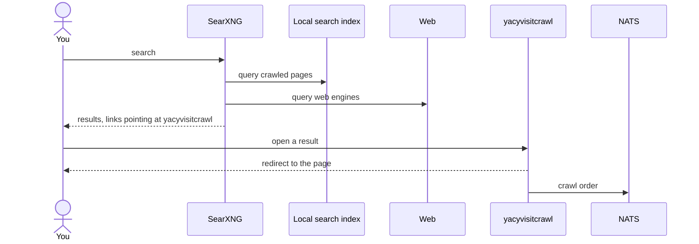
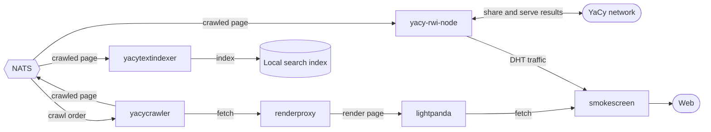

# Full YaCy stack

Runs every piece of the project together: you join the YaCy network as a peer on the DHT
and get your own self-hosted search engine at the same time. Search results blend the pages
you have crawled with the live web, and opening a result crawls that page, so your corpus
grows from what you read.

## The reading loop

What you do, in order. Searching returns results whose links point at yacyvisitcrawl,
so opening one both sends you to the page and queues it to be crawled.

## The pipeline

What happens after a crawl order lands on NATS: the page is fetched and rendered, then
indexed into the search index the reading loop queries, and shared onto the YaCy network.

## Run it

1. Copy `.env.example` to `.env` and set `YACY_PEER_HASH`, `YACY_PEER_NAME`,
   `YACY_ADVERTISE_HOST`, and `YACYVISITCRAWL_PUBLIC_URL`.
2. Copy the SearXNG settings for your chosen engine (see below) to `searxng/settings.yml`
   and set `server.secret_key`.
3. Copy `docker-compose.yml.example` to `docker-compose.yml`.
4. Start the stack: `docker compose up -d`.

## Watching the stack

Prometheus scrapes every service and Grafana shows the crawl-to-serve pipeline at
`http://localhost:3000`. The **Pipeline overview** dashboard is loaded on start,
and Grafana opens without a login. Both run on your machine only.

## Choosing a search-index engine

The stack stores and serves crawled pages from either Elasticsearch (default) or Manticore.
To switch, make the choice in three places, all set to the same engine:

| Engine | `.env` | `docker-compose.yml` include | `searxng/settings.yml` source |
| --- | --- | --- | --- |
| Elasticsearch | `SEARCH_INDEX_ENGINE=elasticsearch` | `compose/search-elasticsearch.yml` | `searxng/settings.yml.elasticsearch.example` |
| Manticore | `SEARCH_INDEX_ENGINE=manticore` | `compose/search-manticore.yml` | `searxng/settings.yml.manticore.example` |

In `docker-compose.yml`, keep exactly one of the two `search-*.yml` include lines uncommented.

See each Go service's `doc/configuration.md` for its environment variables, and
`plugins/searxng/searxng-crawled-text-search/doc/` and `plugins/searxng/searxng-result-router/doc/` for the SearXNG engine
and plugin the search UI runs.
