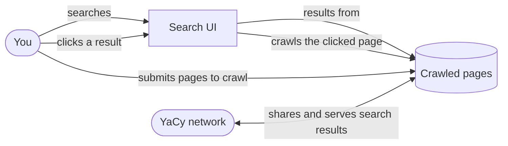

# Full YaCy stack

Runs every currently available piece of the project together, giving you both a YaCy peer
on the DHT and your own self-hosted search engine: you can search a corpus of crawled pages,
and clicking a result also crawls that page, growing the corpus from what you click on.

Use this deployment when you want to operate on the YaCy network and run your own
self-hosted search engine over pages you crawl yourself.

## Run it

1. Copy `.env.example` to `.env` and set `YACY_PEER_HASH`, `YACY_PEER_NAME`,
   `YACY_ADVERTISE_HOST`, and `YACYVISITCRAWL_PUBLIC_URL`.
2. Copy `searxng/settings.yml.example` to `searxng/settings.yml` and set `server.secret_key`.
3. Copy `docker-compose.yml.example` to `docker-compose.yml`.
4. Start the stack: `docker compose up -d`.

See each Go service's `doc/configuration.md` for its environment variables, and
`searxng-crawled-text-search/doc/` and `searxng-result-router/doc/` for the SearXNG engine
and plugin the search UI runs.
