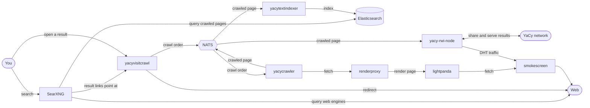

# Full YaCy stack

Runs every piece of the project together: you join the YaCy network as a peer on the DHT
and get your own self-hosted search engine at the same time. Search results blend the pages
you have crawled with the live web, and opening a result crawls that page, so your corpus
grows from what you read.

## Run it

1. Copy `.env.example` to `.env` and set `YACY_PEER_HASH`, `YACY_PEER_NAME`,
   `YACY_ADVERTISE_HOST`, and `YACYVISITCRAWL_PUBLIC_URL`.
2. Copy `searxng/settings.yml.example` to `searxng/settings.yml` and set `server.secret_key`.
3. Copy `docker-compose.yml.example` to `docker-compose.yml`.
4. Start the stack: `docker compose up -d`.

See each Go service's `doc/configuration.md` for its environment variables, and
`plugins/searxng/searxng-crawled-text-search/doc/` and `plugins/searxng/searxng-result-router/doc/` for the SearXNG engine
and plugin the search UI runs.
