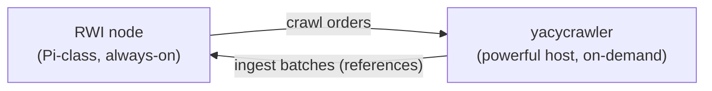
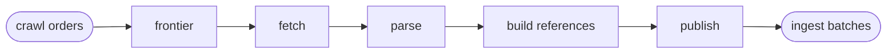

# yacycrawler

> **Experimental prototype.** Not production-ready. Interfaces, message shapes, and
> behavior change without notice, and nothing here is stable to build on yet.

An optional, disposable crawl service that fetches URLs, builds YaCy-compatible RWI
postings and URL metadata, and publishes them toward a YaCy RWI node without storing
document bodies.

For what the package does and how the pieces fit together, see the package doc in
[`doc.go`](doc.go). For the messages the node and crawler exchange, see
[`doc/crawl-contract.md`](../doc/crawl-contract.md).

## Why two separate services

The RWI node is built to run unattended on Raspberry-Pi-class hardware: it stores and
serves the Reverse Word Index and deliberately does not crawl. Crawling is bursty,
CPU- and bandwidth-hungry, and benefits from a real browser engine — work that does not
belong on the always-on node.

So crawling lives here, as a **separate, optional, disposable** service meant to run on
a more powerful machine (a home PC you can freely turn off). It contributes exactly what
the YaCy DHT natively exchanges — *references*, not documents: word-index postings plus
URL metadata. No document bodies are stored or shipped anywhere.

## Target architecture

The crawler is a pipeline of stages, wired together in
[`cmd/yacycrawler/main.go`](cmd/yacycrawler/main.go):

Stages hand work to one another only through a small queue seam, never by direct calls, so
the topology can be reshaped or distributed without touching stage logic. That same seam is
the boundary between the crawler and the node: the node sends crawl orders down and the
crawler sends references back up, each over its own one-way queue.

The message types for both directions live in the standalone `yacycrawlcontract` module,
so neither service depends on the other. For what those messages carry and why, see
[`doc/crawl-contract.md`](../doc/crawl-contract.md).

This lets the prototype run **standalone**: no node, no network, no broker. An in-process
bounded queue stands in for a message broker, an order is built locally from config, and a
fake node drains the ingest queue and records what it received, so the full path can be
exercised in tests. The real node-side order producer, the remote-crawl receiver, and a
real broker are future work.

### Why a message queue between them

- **Independent lifecycles.** The crawler can come and go (powered off, restarted, scaled
  out) while the node stays up; queued batches decouple the two.
- **Backpressure.** The queue is bounded, so a busy node naturally slows fast crawlers
  instead of being overwhelmed.
- **Fan-in / fan-out.** Each direction is one-way, so multiple crawler instances can feed
  one node and the node can fan crawl orders back out over the same seam.
- **One swap point.** Replacing the in-process stub with a real broker is a single,
  well-isolated change that does not ripple into pipeline stages or the node.

## Known gaps

- The node ingest side is faked; there is no real broker or real node integration.
- URL hashing is not yet verified against the YaCy Java reference.
- Politeness and bot-wall handling are minimal heuristics, not hardened.
