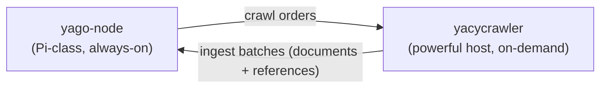

# yacycrawler

> **Experimental prototype.** Not production-ready. Interfaces, message shapes, and
> behavior change without notice, and nothing here is stable to build on yet.

An optional, disposable crawl service that fetches URLs, builds extracted
document ingest payloads plus YaCy-compatible RWI postings and URL metadata, and
publishes them toward `yago-node` without storing unbounded raw HTML bodies.

## Why two separate services

`yago-node` is built to run unattended on Raspberry-Pi-class hardware: it stores
and serves YaCy-compatible P2P state and local search building blocks, and
deliberately does not crawl. Crawling is bursty, CPU- and bandwidth-hungry, and
benefits from a real browser engine — work that does not belong on the always-on
node.

So crawling lives here, as a **separate, optional, disposable** service meant to run on
a more powerful machine (a home PC you can freely turn off). It contributes
bounded extracted content for local search plus exactly what the YaCy DHT
natively exchanges: word-index postings and URL metadata. Raw HTML bodies are
not stored or shipped by default.

## How it runs

The crawler is a long-running, order-driven service. It connects to a NATS JetStream
broker on startup and then idles until work arrives: the node publishes crawl orders to
the orders subject, the crawler fetches pages, builds document/RWI/URL metadata
artifacts, and publishes ingest batches back to the node over the ingest
subject. Multiple crawler instances can share the orders subject to
load-balance, and a bounded ingest stream applies backpressure when the node
falls behind.

Configuration comes from the environment (`NATS_URL` and `YACYCRAWLER_PROXY_URL`
are required), and the service runs until it receives `SIGINT` or `SIGTERM`.
Outbound fetches, including the headless browser, use the configured proxy. Before
robots.txt or browser navigation starts, the crawler rejects non-HTTP(S), loopback,
private, link-local, multicast, unspecified, documentation/test, and metadata-local
destinations. The final rendered URL is checked against the same public-web policy.
The default fetch path uses a bounded HTTP GET first and falls back to the
headless browser only when that fast path rejects the page. The HTTP fast path
follows at most `YACYCRAWLER_MAX_REDIRECTS` redirect hops and uses explicit
request, connect, TLS, and response-header timeout budgets. The container image
embeds the pinned headless-shell runtime in a scratch non-root image.

The message types both services exchange live in the standalone
[`yacycrawlcontract`](../yacycrawlcontract/README.md) module, so neither service depends
on the other.

## Known gaps

- The persistent frontier, politeness model, and recrawl scheduler are still
  prototype-grade.
- Browser-level redirect interception is still planned; the current public-web
  admission check, HTTP redirect cap, HTTP timeout budgets, and HTTP final-URL check are
  application-layer guards plus proxy defense in depth.
- Bot-wall handling remains a minimal heuristic, not hardened production
  behavior.
