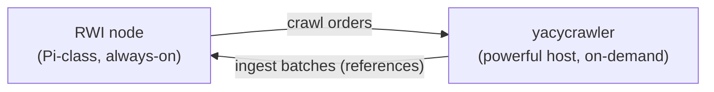

# yacycrawler

> **Experimental prototype.** Not production-ready. Interfaces, message shapes, and
> behavior change without notice, and nothing here is stable to build on yet.

An optional, disposable crawl service that fetches URLs, builds YaCy-compatible RWI
postings and URL metadata, and publishes them toward a YaCy RWI node without storing
document bodies.

## Why two separate services

The RWI node is built to run unattended on Raspberry-Pi-class hardware: it stores and
serves the Reverse Word Index and deliberately does not crawl. Crawling is bursty,
CPU- and bandwidth-hungry, and benefits from a real browser engine — work that does not
belong on the always-on node.

So crawling lives here, as a **separate, optional, disposable** service meant to run on
a more powerful machine (a home PC you can freely turn off). It contributes exactly what
the YaCy DHT natively exchanges — *references*, not documents: word-index postings plus
URL metadata. No document bodies are stored or shipped anywhere.

## How it runs

The crawler is a long-running, order-driven service. It connects to a NATS JetStream
broker on startup and then idles until work arrives: the node publishes crawl orders to
the orders subject, the crawler fetches and builds references, and publishes ingest
batches back to the node over the ingest subject. Multiple crawler instances can share
the orders subject to load-balance, and a bounded ingest stream applies backpressure when
the node falls behind.

Configuration comes from the environment (`NATS_URL` is required), and the service runs
until it receives `SIGINT` or `SIGTERM`.

The message types both services exchange live in the standalone
[`yacycrawlcontract`](../yacycrawlcontract/README.md) module, so neither service depends
on the other.

## Known gaps

- The node-side order producer and ingest consumer are not yet implemented; the crawler
  is exercised against an embedded broker in tests.
- Politeness and bot-wall handling are minimal heuristics, not hardened.
