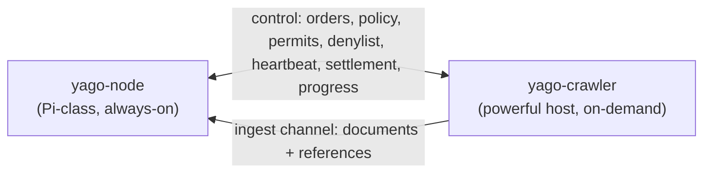

# yago-crawler

> **Alpha software.** This worker is release-packaged and used on live nodes, but
> its operational interfaces may still evolve. Keep coordinated node-and-crawler
> backups and upgrade both binaries from the same release.

An optional crawl service that fetches URLs, builds extracted
document ingest payloads plus YaCy-compatible RWI postings and URL metadata, and
publishes them toward `yago-node` without storing unbounded raw HTML bodies.

## Why two separate services

`yago-node` is built to run unattended on Raspberry-Pi-class hardware: it stores
and serves YaCy-compatible P2P state and local search building blocks, and
deliberately does not crawl. Crawling is bursty, CPU- and bandwidth-hungry, and
benefits from a real browser engine — work that does not belong on the always-on
node.

So crawling lives here, as a **separate, optional** service meant to run on
a more powerful machine (a home PC you can freely turn off). It contributes
bounded extracted content for local search plus exactly what the YaCy DHT
natively exchanges: word-index postings and URL metadata. Raw HTML bodies are
not stored or shipped by default.

## How it runs

The crawler is a long-running, order-driven service. It opens separate control
and ingest connections to the node's crawl gRPC endpoint on startup and then
idles until work arrives. The control connection carries runtime-policy reads,
orders, fleet fetch-start permits, revisioned denylist delivery, heartbeats,
settlement, and progress; the ingest connection carries document/RWI/URL
metadata batches. A large ingest call therefore cannot queue lease or progress
traffic on the same transport.

Multiple crawler instances can each stream orders from the node to load-balance,
and the node's blocking ingest call applies backpressure when it
falls behind. Each order is leased rather than handed off: the crawler acks a
finished order, terminates an operator-cancelled order, requeues a retryable
failure, and heartbeats every active lease. A stream disconnect leaves those
durable leases owned by the same worker. The crawler persists one worker identity
per data directory and creates a new session identity per process. A reconnecting
process adopts and renews the same worker's session-aware leases even after their
deadline; every ingest, progress, and settlement mutation remains fenced by the
exact live lease and session. The node retains that stable-worker ownership across
restart and requeues only expired deferred or legacy sessionless leases. Graceful
shutdown retains unfinished checkpoints, stops heartbeating their unsettled
leases, and leaves them available for immediate or delayed same-worker adoption
from the same data directory. Heartbeat calls have a one-second deadline. An
omitted or expired active lease cancels the current order stream and forces a
same-worker reconnect, so a delayed heartbeat cannot leave parked work waiting
indefinitely on an otherwise healthy stream. That stream-attempt cancellation
also interrupts a confirmed delivery waiting behind local active-run admission,
so a live crawler reopens its logical session after a node process restart rather
than remaining attached to a dead delivery attempt. Each ordinary delivery is
confirmed with a heartbeat that targets its lease; the node does not claim or
send another order for that session until the renewal succeeds. Confirmation
occurs before the payload is decoded, so an undecodable order remains a tracked
grant until its settlement succeeds or the stream reconnects. The node also
accepts a successful session-authorized disposition of that exact lease as
receipt evidence, preventing legacy malformed-order handling from stranding
delivery credit. Reconnect replay
retains the 1,024-active-lease safety ceiling but frames adopted work as ordered
batches of at most 16. The first frame carries that batch's complete lease-ID
header. The crawler validates and confirms only those IDs before exposing the
first order, and the node waits for that confirmation before sending the batch
remainder.
Subsequent payloads must match the header and final marker. Periodic heartbeats
still carry the complete active lease set, and a current crawler continues to
accept the older single-batch recovery shape. Order payloads are never retained
as one complete recovery set. A settlement attempt protects its grant from local
expiry and from an omitted response to a heartbeat already in flight, while full
heartbeats continue carrying the grant so a live node lease is renewed. A final
failure restores omission and expiry handling immediately. Concurrent attempts
retain protection until the last one fails. A successful ordinary settlement
removes its local grant without reporting lease loss. A rich terminal settlement
does the same as soon as its first-phase confirmation token is durably recorded,
before the final confirmation RPC, so neither path cancels an otherwise healthy
order stream.

An order carries explicit normal or automatic-discovery priority. The node
persists the two lanes and their shared admission sequence. With discovery
priority enabled it selects at most three automatic-discovery orders before a
waiting normal order; with the setting disabled it selects both lanes in exact
global FIFO order. Priority survives lease expiry, requeue, and node restart,
and the crawler does not infer it from a profile name.

Running progress never blocks crawl execution. Absolute snapshots use one bounded
ordered per-run queue; adjacent running updates coalesce, only one RPC is active,
and deterministic phases spread reports instead of synchronizing 20 or more runs.
The node authorizes a progress report through its exact lease, worker, session,
and run once, then reuses that verified run target for control reconciliation and
recording instead of scanning every active lease again. Crawler progress warnings
render the byte provenance as a lowercase hexadecimal `runId`, never as raw text.
Terminal progress follows a separate durable outbox. It is committed with the
exact order identity, lease, session, tally, rate, and disposition before network
delivery; at most 64 rows await delivery and four workers reconcile them. The node
records the terminal snapshot idempotently and returns a confirmation token before
the crawler deletes either the outbox row or frontier checkpoint. A replacement
lease arriving after an in-memory drain recovers that rich settlement instead of
acknowledging without its final tally.
Each snapshot includes the run's effective pages-per-minute limit: its explicit
override, the crawler default, or zero for unlimited dispatch. The node can
therefore display the active rate without guessing the worker's configuration.
Its Crawler monitor combines runs from every profile, renders exactly 20 rows per
page, and keeps totals and health based on the complete snapshot.

The node rebuilds an in-memory worker/session active-lease catalog from the
durable lease bucket when the crawl broker opens. Successful claim, adoption,
settlement, defer, and requeue transitions update it after commit, so capacity
admission is O(1) and does not rescan every lease for each streamed order. The
dedicated bbolt engine serializes writers through context-aware admission. A
cancelled RPC can stop while queued, and cancellation is checked again before the
transaction callback and before commit so stale work rolls back. Delivery-credit
waits hold neither that writer admission nor the worker-session registry lock.

Because an order can therefore be delivered more than once, each admitted page
receives an observation ID and UTC observation time that survive frontier replay;
the same values reach live ingest or a tombstone. The node durably keeps
the newest completed observation per URL before acknowledging ingest, so a lost
acknowledgement or an older redelivery cannot replace newer indexed state.
Document ingest includes the fetched URL and any resolved
`rel=canonical` URL found in the page, plus page-provided description
metadata and bounded image URL/alt metadata when available. Links marked
`rel=nofollow` are not submitted for frontier expansion or local outlink
evidence unless the crawl profile opts in.

Every newly parsed live document is stamped with
`CurrentExtractionGeneration`, currently `1`, before it crosses the ingest
boundary. Generation `0` is reserved for older unstamped payloads. A material
parser or extractor change that requires stored content to be fetched again
advances the shared constant. This does not start a background migration: an
operator uses the bounded Admin → Index action to queue older stored documents
through the node's existing durable crawl dispatcher.

Discovered links whose URL path has an unambiguous suffix for a disabled parser
family, or for the unsupported AppImage, DEB, DMG, EXE, ISO, MPKG, MSI, PKG,
RPM, TXZ, or XZ container formats, are rejected before frontier admission.
Explicit seeds are still fetched once, and extensionless routes, unknown
suffixes, and suffix-like query values remain eligible so the authoritative
response media type can route them. Unknown or mislabeled binary bodies are
sniffed before the HTML and plain-text fallback, while genuine Unicode text,
HTML, and registered format parsers retain their normal routing.

Markdown belongs to the Text format family. Enabled Text profiles admit `.md`
and `.markdown` URLs even when the server reports `application/octet-stream`,
and extensionless responses route through `text/markdown` or
`text/x-markdown`. Binary-looking bodies still fail closed before parsing.

Concurrent runs requesting the same normalized URL share one in-flight fetch
only when their TLS, robots, and browser-fallback policies match. Each run gets
an independent page copy and still applies its own redirect, parser, directive,
scope, indexing, tally, and delivery policy. A completed response is not cached.

The HTTP and browser paths retain at most the configured body ceiling as a
bounded prefix; exceeding it is not a fetch failure. This keeps large documents
partially searchable without retaining an unbounded response, and all parsing
and ingest limits apply to that same prefix.

Every ingest JSON body is bounded below the 4 MiB gRPC message ceiling. Text,
URLs, headings, links, metadata, and RWI term counts have explicit limits, and
the crawler trims optional references before transport when their combined
encoding would exceed that ceiling. If JSON escaping alone makes extracted text
too large, the sender retains the longest fitting valid UTF-8 prefix and reduces
optional document metadata deterministically. Seed, redirect, source, normalized, and
canonical identity URLs longer than 2,048 bytes are rejected instead of being
truncated into a different identity; overlong URL-bearing references are
dropped. Current nodes report saturation separately as `Unavailable`, and the
crawler also accepts the legacy `ResourceExhausted` saturation code only after
fitting its payload below the shared ceiling. Both use bounded jittered exponential retry
delays, so backpressure cannot become a tight localhost resend loop.
The receiving node coalesces at most 64 ready deliveries and 64 MiB of their
encoded JSON for grouped document, Bleve, metadata, posting, stale-sweep, and
recrawl commits. A partial group waits at most ten milliseconds and stops
waiting immediately when its context is cancelled. Populated Bleve shards
persist through at most four concurrent commit lanes, so batching cannot create
an unbounded ingest delay or an eight-shard persistence burst.
Within that group, the node replaces outbound-anchor sources in groups of at
most 16, aggregates their contributions once, and projects affected documents in
pages of at most 16 exact target URLs. Target transactions retain at most 32
physical rows and 8 MiB. After projection, sorted final source rows use
deterministic subtransactions with a 64 MiB encoded ceiling. A page, capacity,
index, or publication failure retries the original delivery group before
metadata, postings, or acknowledgements advance; earlier publication groups may
already be committed, and replay recomputes the remainder idempotently. This
changes no crawler message or checkpoint format.
Before those storage operations begin, the node snapshots the submitting
worker, process session, exact lease, and run authorization under its short
lease-mutation boundary. It releases that boundary before document or index
storage. Once authorized, the idempotent ingest absorption completes against
that snapshot even if the lease changes later; a stale submission is rejected
before its first storage side effect.

HTML is decoded to UTF-8 with browser-compatible WHATWG encoding labels from
the HTTP `Content-Type` and early HTML metadata. Before one page becomes a
document, URL metadata, and RWI postings, the crawler resolves their shared
ISO 639-1 language once from at most 64 KiB of extracted main text. Reliable
content evidence wins; a valid HTML `lang` declaration is the fallback for
uncertain text, and English is used only when neither source identifies a
language. This includes legacy pages served as Windows-1251 without a `lang`
attribute.

PDF extraction follows the document structure rather than scanning every decoded
stream. When Page objects are available, it selects their referenced `/Contents`
streams, including indirect arrays, and only Form XObjects reachable from page
resources. A PDF whose Page objects cannot be resolved uses a bounded fallback
that excludes known non-page and binary stream classes. Image data, embedded font
programs, metadata, object containers, cross-reference streams, embedded files,
and CMaps are excluded from text extraction. This prevents binary payloads such
as those in the reported Berkeley `battelle_ucb07.pdf` from entering cached text
or the index.

For a simple font, an embedded `/ToUnicode` entry has precedence for each code it
defines. A missing code may use a bounded single-byte fallback that resolves the
font's `/Encoding` as a predefined name or as an inline or indirect dictionary,
copies a supported `/BaseEncoding`, and applies `/Differences` without exceeding
the 256-code space or the document's existing object and byte budgets. Glyph
names map through the standard Adobe Glyph List rules, including variant suffixes,
composed names, and valid `uni` or `u` scalar names. An unknown glyph, malformed
sequence, unresolved reference, or exhausted decoder budget leaves the code
unmapped; a selected custom font is never interpreted as raw ASCII, Latin-1, or
TeX ligature bytes merely because its mapping is unavailable.

CMap, font-encoding, and page/Form decoding share one 32 MiB document budget, and
extracted UTF-8 text stops at 1 MiB. Repository tests use bounded synthetic PDFs,
including the custom-encoding shape of Cisco's live ENCS document; external PDFs
remain verification-only downloads. The bounded extraction-generation action on
Admin → Index can queue a normal recrawl to replace text that an older extractor
already stored for either reported PDF. Extraction remains embedded-text only and
performs no OCR.

Crawl requests can start from normal URLs, XML sitemaps, sitemap indexes, plain
text sitelists, or a host's `robots.txt`. Sitemap and sitelist starts are fetched
through the same proxied public-web egress path as page fetches, parsed before
frontier admission, and expanded into bounded URL roots. A `robots` start fetches
the seed host's `robots.txt` over that same path and expands the sitemaps named in
its `Sitemap:` directives. A 404 or 410 response discovers nothing; network,
resolver, throttling, timeout, and server failures nak the leased order for
redelivery. Deterministic public-web admission and SSRF-policy rejections, invalid
seed modes or URLs, deterministic client responses, and malformed sitemap content
terminate the poison order instead of retrying forever. Sitemap `lastmod` values
are carried through the persistent frontier and ingest boundary into the node's
durable recrawl scheduler. A valid non-future hint can advance the next fetch
within the profile cadence; advancing observations can learn a shorter change
interval, while future, stale, and unchanged values cannot create an immediate
recrawl loop.

Configuration comes from the environment (`YAGO_CRAWLER_NODE_RPC_ADDR` is required;
`YAGO_DATA_DIR` defaults to `./data` and contains `crawler/frontier-v1.db`;
`YAGO_CRAWLER_WORKER_ID` is an optional one-line display prefix of at most 219
bytes for the stable identity stored in that checkpoint; the crawler appends a
hyphen and UUID within the 256-byte wire limit;
`YAGO_CRAWLER_STORAGE_RESERVED_FREE` defaults to 1 GiB and
`YAGO_CRAWLER_STORAGE_PRESSURE_HYSTERESIS` defaults to 256 MiB;
`YAGO_CRAWLER_FRONTIER_STATE_MAX_BYTES` defaults to 4 GiB and sets a soft
physical boundary for `crawler/frontier-v1.db`, while `0` disables it. The crawler
measures the filesystem containing its data directory, fails closed when that
measurement is unavailable, and waits before new fetch or frontier-growth
admission when free space reaches the reserve. It resumes only after free space
reaches the reserve plus hysteresis. Before opening the checkpoint, a successful
runtime-policy read applies the live `crawler.storage_reserved_free` and
`crawler.storage_pressure_hysteresis` Admin values, including explicit zero; an
older node that omits either additive startup field leaves the matching
environment bootstrap in effect. Later live changes continue through worker
heartbeats. An existing checkpoint opens for recovery, and deletion, settlement,
and completed-work cleanup remain available. Bounded schema and stable-identity
bootstrap writes are outside this advisory gate;
`YAGO_CRAWLER_WORKERS` starts 4 page-fetch workers by default and accepts 1–256;
the same bootstrap value belongs in the node environment, whose persisted Admin
setting becomes authoritative for every connected process after heartbeat;
`YAGO_CRAWLER_MAX_PAGES_PER_SECOND` defaults to 10 page-fetch starts per second
for the complete connected crawler fleet and accepts 0–1,000,000, where zero is
unlimited; the same bootstrap value belongs in the node environment, and the
live `crawler.max_pages_per_second` Admin setting becomes authoritative after
heartbeat. The node grants strict relative start windows from one non-bursting
schedule. The crawler measures each completed lease RPC from request start to
response receipt, caps the observation at one second, and reports it on the next
sequence. The node adds that prior delivery allowance to the next demand-backed
batch and reserves the complete enlarged final window before another batch. The
crawler intersects relative openings with response receipt and closings with
request send, then enforces one configured interval between permits it actually
consumes. A delivery spike beyond the previous allowance may discard a window,
but cannot cause a catch-up burst; its measurement applies to the next sequence.
The crawler keeps the same value as a local process smoother and requests only
demand-backed permit batches bounded by its live worker concurrency. Per-run and
per-host limits continue to apply independently;
`YAGO_CRAWLER_MAX_ACTIVE_RUNS` defaults to 32 and accepts 1–256; it bounds the
distinct crawl tasks whose prepared orders, frontiers, and progress reporters
may remain active in each process, independently of page-fetch concurrency. The
same bootstrap value belongs in the node environment, and the live
`crawler.max_active_runs` Admin setting becomes authoritative after heartbeat;
`YAGO_CRAWLER_RUN_PAGES_PER_MINUTE` defaults to 30 and limits each active run
independently, with per-host crawl delay and concurrency applying additional
politeness;
`YAGO_CRAWLER_PRIORITIZE_AUTOMATIC_DISCOVERY` defaults to `true` in both service
environments and gives explicit discovery work at most three due page dispatches
before waiting normal work; a successful startup heartbeat applies the node's
persisted value before order intake, while a failed one-second attempt retains this
bootstrap until a periodic heartbeat succeeds;
each heartbeat also reports the current number of occupied page-fetch worker jobs,
where a job stays occupied through fetch, parsing, and result publication;
`YAGO_CRAWLER_ALLOW_PRIVATE_NETWORKS` opts into all LAN and private-network targets,
while `YAGO_CRAWLER_ALLOW_CIDRS` is a comma-separated list of private CIDRs to admit
instead of opening all private space; loopback, link-local, and reserved ranges
stay blocked either way). The same bootstrap values for the private-network
policy, Firefox executable and content sandbox, browser failure threshold,
loopback metrics listener, origin timeouts, crawl delay, depth, per-host
concurrency, per-run default rate, sitemap limit, shutdown grace, and HTTP
User-Agent belong in both service environments. Before assembling its fetch
stack, the crawler reads the node's typed authoritative policy. A sandbox-only
heartbeat change lets an active render finish and retires the affected Firefox
session before that slot's next render. A frontier-state boundary change applies
live and wakes fresh orders waiting at the old boundary; every other policy
change requests a graceful automatic restart. The optional sandbox,
browser-path, metrics-address, frontier-state, storage-reserve, and storage-
hysteresis fields keep their current bootstrap or effective values when an older
policy-capable node omits them. An older node without that additive RPC leaves
the environment bootstrap in use.

The Index URL/domain denylist is also authoritative crawler policy. Before the
order stream opens, the crawler obtains one bounded revisioned snapshot from the
node and fails closed until it has a valid policy. Heartbeats transfer a new
snapshot only when its revision changes, and an invalid later delivery cannot
replace the last valid snapshot. Exact URLs and domain suffixes are rejected
before seed or discovered-link frontier admission and around every HTTP,
sitemap, and browser fetch, including its final redirected URL. This reuses the
existing Index policy and introduces no crawler environment variable.

The service runs until it receives `SIGINT` or
`SIGTERM`, then shuts down gracefully: it stops pulling new jobs but lets
in-flight page fetches finish, waiting up to `YAGO_CRAWLER_SHUTDOWN_GRACE`
(default `10s`) before aborting any still running. It detaches queued local work
from memory without deleting its checkpoint and leaves an unfinished lease
unsettled. A replacement process using the same data directory and stable worker
identity adopts that session-aware lease before or after its deadline; expiry
does not release it to another worker. Deferred and legacy sessionless leases
retain ordinary expiry and global requeue. The crawler waits for already-staged
terminal settlements before closing both node connections. Replay keeps the same
run identity, observation IDs, absolute tally, and remaining frontier. The first
recovery frame declares the complete adopted-lease manifest, and later batches
of at most 16 must be nonrepeating subsets of it. A keepalive retains the full
set without granting delivery credit; an explicit targeted heartbeat confirms
only the current batch. The crawler rejects an incomplete manifest, an unknown
or repeated lease, recovery after ordinary streaming begins, or ordinary work
before the declared recovery prefix is complete.

Deleting frontier rows may leave reusable pages inside `frontier-v1.db` without
increasing operating-system free space. If pressure persists, free space on the
backing filesystem or lower the reserve and hysteresis before resuming. The
policy is early backpressure, not an aggregate hard quota: ordinary allocation,
bbolt growth granularity, and files outside the gate can still consume space.
Use a filesystem or project quota, or a quota-capable volume, for an enforced
maximum.

The frontier-state boundary inspects the checkpoint file once per fresh-order
admission attempt and once for each discovered-link mutation batch, never for
each URL.
At or above the boundary, a fresh order waits before seed expansion and resumes
after a live increase or disable; an order whose already committed seed manifest
crosses the boundary remains durable existing work and completes normally. New
discovered links are refused rather than retained for later admission. Existing
queued pages, recovery, lifecycle changes, and terminal settlement continue.
On startup at or above the boundary, the crawler takes a persistent path-stable
sidecar lease and holds it through stale-copy cleanup, private sibling-copy
compaction, atomic replacement, directory sync, inspection, and authoritative
database open. It measures the actual source size and reserves that temporary
headroom inside the shared serialized storage-maintenance gate before copying.
A failure before replacement is logged and leaves the original authoritative;
an installed replacement with a later directory-sync warning is reported as
installed, not skipped.

A live worker-count update stops new frontier intake and waits for the current
page fetches to complete before replacing the worker group with the latest
requested size. Several updates during that drain coalesce to the newest value.
Shutdown keeps its separate grace deadline and may still cancel a fetch that
outlives it. The count applies per crawler process; it never limits the number
of admitted crawl runs or queued tasks.

A live active-task update changes a separate completion-driven admission gate.
Increasing it wakes waiting orders. Decreasing it does not cancel or preempt an
already admitted task; existing tasks finish normally, and new prepared orders
wait until occupancy falls below the new limit. An active-task slot is held from
prepared-order admission through the matching terminal completion callback, so
waiting orders do not activate another frontier or periodic progress reporter.

Outbound fetches, including the headless browser, are screened in-process at dial
time against the connected IP address, so no external forward proxy is required;
the browser routes through a loopback-bound guarded proxy that resolves and dials
targets under the same policy. Before robots.txt or browser navigation starts, the
crawler also rejects non-HTTP(S), loopback, private, link-local, multicast,
unspecified, documentation/test, and metadata-local destinations. The final
rendered URL is checked against the same public-web policy. Each fetched
`robots.txt` is limited to the first 500 KiB before parsing, as required by RFC
9309, so an untrusted host cannot force an unbounded allocation. Policies are
cached per scheme and authority for at most 24 hours. Network and server failures
fail closed for five minutes, coalesce concurrent refreshes, and retain the last
known rules, preventing both stale permanent decisions and retry storms.
The default fetch path uses a bounded HTTP GET first and falls back to a lazy
pool of at most two long-lived headless Firefox sessions (driven over the
Marionette protocol) when that fast path returns a browser-resolvable rejection
or a successful HTML document has executable JavaScript but its bounded main-text
extraction contains neither four terms nor sixteen letters or digits. Scriptless
and non-HTML responses, JSON data scripts, usable static HTML, and profiles that
disable browser rendering keep their single fast-path fetch. This removes a
global render convoy without launching one browser per crawl worker. The HTTP
fast path and Firefox fallback follow at most `YAGO_CRAWLER_MAX_REDIRECTS`
redirect hops and use explicit request, connect, TLS, and response-header timeout
budgets. The default is 10, zero rejects the first redirect, and the node's
persisted `crawler.max_redirects` setting applies live after heartbeat. Guarded
HTTP clients read the new limit immediately; Firefox sessions close and lazily
relaunch with the new limit before the next render. The persisted
`crawler.browser_sandbox` setting follows the same session boundary: it changes
Firefox's next launch without interrupting an active render. The bootstrap
`YAGO_CRAWLER_BROWSER_SANDBOX` value defaults to `false` in both service
environments and remains in effect when an older node omits the optional policy
field. An empty `YAGO_CRAWLER_BROWSER_PATH` discovers optional `firefox-esr`,
then `firefox`, through `PATH`; a nonempty value names an absolute launcher with
exactly one of those basenames. The crawler resolves and validates a discovered
or configured launcher before browser assembly and immediately before every
spawn. The original path, symlinks, resolved executable, and every replaceable
ancestor must be root-owned and not group- or other-writable; the target must be a
regular, non-set-ID executable available to the crawler identity. An unsafe or
missing explicit path fails startup. Empty discovery with no installed Firefox
keeps the HTTP fast path operational and reports an error only when a page needs
the browser fallback. Sitemap and
sitelist expansion imports at most `YAGO_CRAWLER_SITEMAP_URL_LIMIT` URLs per
seed. The container image bundles Firefox ESR on a pinned Alpine runtime and
runs as a non-root user. Its Go builder and Alpine runtime bases are pinned by
SHA-256 digest. A build with
`SOURCE_REVISION=$(git rev-parse HEAD) make compose-images` records that commit
and the repository URL in both final images' OCI revision and source labels; an
unstamped build records revision `unknown`.

The in-memory ready and scoring window has a fixed capacity shared fairly across
active runs, so dispatch work never scans every admitted URL. An exact bbolt
frontier under `YAGO_DATA_DIR` stores the complete seed manifest and admission
cursor, visited set, ordered outstanding pages, host limits and pace, controls,
completion state, terminal outbox, and stable ingest observation identity.
Seed publication, admission, cancellation, host retirement, and deletion use
crash-resumable transactions of at most 256 rows. Restart recovery loads at most
256 persisted pages per run and refills below 128 pages without loading the full
visited set. Each committed discovered or seed admission extends the durable
sequence boundary and enters the same refill cursor. Candidate admission reads
exact visited, retired-host, host-total, and run-total state from bbolt; only the
bounded queued, ready, and in-flight window retains page and host state in memory,
and completion evicts it. An unfinished seed manifest is another lazy producer
sharing the same live window. Round-robin selection stores each resident host
once, skips whole future-rate runs, and probes active hosts without walking every
durable page. The default 50,000-page per-run limit still bounds the durable run
(`0` removes that per-run bound) without making resident memory proportional to
that value. Workers atomically claim jobs through `Frontier.Take`, with no
buffered prefetch layer. Pause withholds pending work until resume, while
cancel persists its marker before removing queued pages and waits for any in-flight
page outcome. A process crash treats only still-outstanding pages as replayable;
already committed pages retain their exact observations and are not fetched again.
If the node replaces an order-stream lease, the frontier atomically rebinds the run
and rejects stale completion under the old lease. Unconfirmed grants park fetch
workers on grant/frontier change notifications instead of polling through repeated
claims. Shutdown makes one detached five-second settlement attempt window; if the
node stays unavailable, the next process using the same data directory resumes the
checkpoint. An expired session-aware lease remains parked for that stable worker,
so a different worker cannot restart the traversal from an unrelated data
directory; deferred and legacy sessionless leases still requeue normally.

Fetched progress counts accepted response bodies. Failed progress counts fetch
failures and later processing failures, so an unparseable response increments
both fetched and failed. The Admin failure rate is failed / (fetched + failed),
which remains bounded at 100%; HTTP protocol fallbacks and browser attempts
within one page job do not inflate the numerator. Recent per-URL outcomes retain
at most 64 entries and expose only bounded URLs, outcome classes, timestamps,
status codes when available, and stable operator reasons. They never carry page
content or raw parser errors. Each retained URL has one terminal class: fetched,
indexed, failed, robots denied, duplicate, or skipped. These per-URL classes are
mutually exclusive even though the aggregate fetched and failed counters are not.
Stable reasons distinguish URL parsing, fetch and robots rejection, unsupported
content, parsing, indexing, ingest delivery, page directives, profile policy,
redirect admission, and document removal without exposing provider errors.
Progress also reports the immutable effective whole-run maximum and per-host
maximum as separate values. An unlimited value is explicit; an older or incomplete
report remains unavailable rather than being presented as zero.
Each admitted run publishes its initial running snapshot with the immutable
seeded queue depth before terminal settlement may report completion. Later
running snapshots read the live pending depth, and no running snapshot can follow
the terminal state. Progress transport keeps the current in-flight generation
immutable. New running snapshots for the same run coalesce into its latest
pending replacement, while ready terminal reports take priority and other ready
runs receive service before that replacement. The bounded queue may therefore
omit intermediate running values, but it preserves phase chains and protects an
in-flight attempt from tail eviction.
Host availability is tracked separately from that display tally. Connection,
DNS, timeout, 403, 408, 429, and server failures back off only their host; a
served representation accepted for parsing resets the consecutive-failure
evidence. Five consecutive
availability failures retire the remaining URLs for that host in that run and
emit one warning with the run, host, and dropped-page total. A single-host run
then finishes normally, while a multi-host run continues its healthy hosts. A
404/410 page, unsupported media type, ordinary client rejection, robots denial,
operator cancellation, or permanent egress-policy rejection never retires a
healthy host. Expected URL-specific, robots, and unsupported-format outcomes log
at debug; actionable failures remain warnings.

When `YAGO_CRAWLER_METRICS_ADDR` is set to a loopback IP-literal listener (for
example `127.0.0.1:9101` or `[::1]:9101`), the crawler serves
Prometheus metrics at `/metrics` on that address: `yacy_crawler_jobs_active`,
`yacy_crawler_fetches_total`, `yacy_crawler_fetch_failures_total`,
`yacy_crawler_parse_failures_total`, `yacy_crawler_bytes_total`,
`yacy_crawler_robots_denied_total`,
`yacy_crawler_ingest_batches_total`, `yacy_crawler_host_backoffs_total`, and
`yacy_crawler_browser_slot_acquisition_deadlines_total`, plus filesystem
availability, reserve, hysteresis, pressure, measurement availability, rejected
growth, and measurement-failure storage series under
`yacy_crawler_storage_*`. Browser-pool diagnostics add
`yacy_crawler_browser_slot_acquisition_seconds`,
`yacy_crawler_browser_sessions{state="ready|busy|cooling"}`, and
`yacy_crawler_browser_failures_total{reason="slot_deadline|cooldown|launch|render"}`.
Every state and reason series is initialized even before the first browser
session, and the fixed labels never contain a URL or raw error text. The legacy
browser-slot deadline counter remains available and advances with the
`slot_deadline` failure reason; ordinary request cancellation and crawler
shutdown do not classify as slot-deadline failures. The parse-failure counter
advances when a fetched body cannot produce an indexable document through any
enabled parser; it is separate from transport fetch failures. When the value is
empty the crawler starts no metrics server and opens no port. Wildcard and
non-loopback listeners are rejected; a trusted tunnel or proxy must mediate a
remote scrape. The environment value bootstraps both services;
Configuration → Crawler persists the authoritative value, delivers it before
assembly, and gracefully restarts connected crawlers after a change.

The message types both services exchange live in the standalone
[`yagocrawlcontract`](../yagocrawlcontract/README.md) module, so neither service depends
on the other.

## Upgrade and rollback

Install `yago-node` and `yago-crawler` from the same release. The current
session-fenced control plane requires a process-session identity that older
crawlers do not send. Stop every crawler before replacing the node, replace both
binaries, start and verify the node, and only then start the crawlers. A remote
crawler host follows the same order and must retain or transfer its own
`YAGO_DATA_DIR`. The recovered-session manifest, explicit delivery-confirmation
marker, and active-task directive are additive protobuf fields. Older decoders
ignore them, and an absent confirmation marker retains the legacy subset rule,
but mixed-version operation is not a supported deployment mode.

Rollback is also coordinated. Stop the crawlers before the node, restore the
matching stopped backup of the node broker and every crawler checkpoint, install
the older node and crawler binaries, then start the node before the crawlers. Do
not open a checkpoint created by a newer crawler with an older binary.

## Known gaps

- A checkpoint is local to its `YAGO_DATA_DIR`; moving an unexpired lease to a
  different crawler host requires transferring or sharing that directory.
- Active-task admission is per crawler process and completion-driven. It does not
  preempt a long-running task or impose a fleet-wide task ceiling. The separate
  fetch-start lease schedule provides the fleet-wide fetch-rate ceiling.
- Sitemap `lastmod` is an untrusted scheduling hint, not proof that content
  changed. A valid non-future hint can advance the next persistent recrawl within
  the profile cadence, and successive advancing hints can learn a shorter change
  interval. Future, stale, and unchanged values never create immediate loops.
- Browser redirect interception is bounded by the same live maximum as the HTTP
  fast path. Public-web admission, timeout budgets, final-URL checks, and the
  guarded browser proxy remain defense in depth.
- Bot-wall handling remains a minimal heuristic, not hardened production
  behavior.
