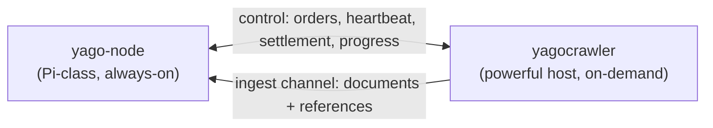

# yagocrawler

> **Experimental prototype.** Not production-ready. Interfaces, message shapes, and
> behavior change without notice, and nothing here is stable to build on yet.

An optional, disposable crawl service that fetches URLs, builds extracted
document ingest payloads plus YaCy-compatible RWI postings and URL metadata, and
publishes them toward `yago-node` without storing unbounded raw HTML bodies.

## Why two separate services

`yago-node` is built to run unattended on Raspberry-Pi-class hardware: it stores
and serves YaCy-compatible P2P state and local search building blocks, and
deliberately does not crawl. Crawling is bursty, CPU- and bandwidth-hungry, and
benefits from a real browser engine — work that does not belong on the always-on
node.

So crawling lives here, as a **separate, optional, disposable** service meant to run on
a more powerful machine (a home PC you can freely turn off). It contributes
bounded extracted content for local search plus exactly what the YaCy DHT
natively exchanges: word-index postings and URL metadata. Raw HTML bodies are
not stored or shipped by default.

## How it runs

The crawler is a long-running, order-driven service. It opens separate control
and ingest connections to the node's crawl gRPC endpoint on startup and then
idles until work arrives. The control connection carries orders, heartbeats,
settlement, and progress; the ingest connection carries document/RWI/URL metadata
batches. A large ingest call therefore cannot queue lease or progress traffic on
the same transport.

Multiple crawler instances can each stream orders from the node to load-balance,
and the node's blocking ingest call applies backpressure when it
falls behind. Each order is leased rather than handed off: the crawler acks a
finished order, naks a cancelled one back to the node for redelivery, and
heartbeats its in-flight leases. A stream disconnect leaves those durable leases
owned by the same worker; a reconnect within that crawler process replays the same
lease IDs before new FIFO work. Every crawler process adds a random suffix to the
configured worker-ID prefix, so a crashed replacement does not claim the old
process's leases; heartbeat expiry and the node sweeper reassign them. Graceful
shutdown naks active leases for prompt redelivery, and node startup requeues every
persisted lease with a new lease identity.

An order carries explicit normal or automatic-discovery priority. The node
persists the two lanes and their shared admission sequence. With discovery
priority enabled it selects at most three automatic-discovery orders before a
waiting normal order; with the setting disabled it selects both lanes in exact
global FIFO order. Priority survives lease expiry, requeue, and node restart,
and the crawler does not infer it from a profile name.

Progress reporting never blocks crawl execution. Each run publishes absolute
snapshots into one bounded ordered per-run queue; adjacent running updates
coalesce, only one RPC is active, and deterministic phases spread periodic
reports across the interval instead of synchronizing 20 or more runs on one tick. A terminal update
receives delivery priority and bounded jittered exponential retry, including
drain attempts within the graceful-shutdown window. A later admitted same-ID
retry remains a separate running phase after that terminal phase, preserving the
order of accepted attempts. At hard capacity, a terminal update first evicts an
expendable singleton running update; if only protected phase chains remain, the
new update is logged and dropped without deleting a separating running phase.
Each snapshot includes the run's effective pages-per-minute limit: its explicit
override, the crawler default, or zero for unlimited dispatch. The node can
therefore display the active rate without guessing the worker's configuration.
Its Crawler monitor combines runs from every profile, renders exactly 20 rows per
page, and keeps totals and health based on the complete snapshot.

Because an order can therefore be delivered more than once, each live page and
tombstone carries a stable observation ID and UTC observation time. The node durably keeps
the newest completed observation per URL before acknowledging ingest, so a lost
acknowledgement or an older redelivery cannot replace newer indexed state.
Document ingest includes the fetched URL and any resolved
`rel=canonical` URL found in the page, plus page-provided description
metadata and bounded image URL/alt metadata when available. Links marked
`rel=nofollow` are not submitted for frontier expansion or local outlink
evidence unless the crawl profile opts in.

Discovered links whose URL path has an unambiguous suffix for a disabled parser
family, or for the unsupported AppImage, DEB, DMG, EXE, ISO, MPKG, MSI, PKG,
RPM, TXZ, or XZ container formats, are rejected before frontier admission.
Explicit seeds are still fetched once, and extensionless routes, unknown
suffixes, and suffix-like query values remain eligible so the authoritative
response media type can route them. Unknown or mislabeled binary bodies are
sniffed before the HTML and plain-text fallback, while genuine Unicode text,
HTML, and registered format parsers retain their normal routing.

Concurrent runs requesting the same normalized URL share one in-flight fetch
only when their TLS, robots, and browser-fallback policies match. Each run gets
an independent page copy and still applies its own redirect, parser, directive,
scope, indexing, tally, and delivery policy. A completed response is not cached.

The HTTP and browser paths retain at most the configured body ceiling as a
bounded prefix; exceeding it is not a fetch failure. This keeps large documents
partially searchable without retaining an unbounded response, and all parsing
and ingest limits apply to that same prefix.

Every ingest JSON body is bounded below the 4 MiB gRPC message ceiling. Text,
URLs, headings, links, metadata, and RWI term counts have explicit limits, and
the crawler trims optional references before transport when their combined
encoding would exceed that ceiling. If JSON escaping alone makes extracted text
too large, the sender retains the longest fitting valid UTF-8 prefix and reduces
optional document metadata deterministically. Seed, redirect, source, normalized, and
canonical identity URLs longer than 2,048 bytes are rejected instead of being
truncated into a different identity; overlong URL-bearing references are
dropped. Current nodes report saturation separately as `Unavailable`, and the
crawler also accepts the legacy `ResourceExhausted` saturation code only after
fitting its payload below the shared ceiling. Both use bounded jittered exponential retry
delays, so backpressure cannot become a tight localhost resend loop.
The receiving node coalesces at most 16 ready deliveries for grouped document,
Bleve, metadata, posting, stale-sweep, and recrawl commits. A partial group waits
at most two milliseconds and stops waiting immediately when its context is
cancelled, so batching cannot create an unbounded ingest delay.

HTML is decoded to UTF-8 with browser-compatible WHATWG encoding labels from
the HTTP `Content-Type` and early HTML metadata. Before one page becomes a
document, URL metadata, and RWI postings, the crawler resolves their shared
ISO 639-1 language once from at most 64 KiB of extracted main text. Reliable
content evidence wins; a valid HTML `lang` declaration is the fallback for
uncertain text, and English is used only when neither source identifies a
language. This includes legacy pages served as Windows-1251 without a `lang`
attribute.

PDF extraction follows the document structure rather than scanning every decoded
stream. When Page objects are available, it selects their referenced `/Contents`
streams, including indirect arrays, and only Form XObjects reachable from page
resources. A PDF whose Page objects cannot be resolved uses a bounded fallback
that excludes known non-page and binary stream classes. Image data, embedded font
programs, metadata, object containers, cross-reference streams, embedded files, and CMaps are excluded from text extraction. This prevents binary payloads
such as those in the reported Berkeley `battelle_ucb07.pdf` from entering cached
text or the index. CMap and page/Form decoding share one 32 MiB document budget,
and extracted UTF-8 text stops at 1 MiB. Documents stored by an older extractor
need one normal recrawl to replace their existing text; no OCR is performed.

Crawl requests can start from normal URLs, XML sitemaps, sitemap indexes, plain
text sitelists, or a host's `robots.txt`. Sitemap and sitelist starts are fetched
through the same proxied public-web egress path as page fetches, parsed before
frontier admission, and expanded into bounded URL roots. A `robots` start fetches
the seed host's `robots.txt` over that same path and expands the sitemaps named in
its `Sitemap:` directives. A 404 or 410 response discovers nothing; network,
resolver, throttling, timeout, and server failures nak the leased order for
redelivery. Deterministic public-web admission and SSRF-policy rejections, invalid
seed modes or URLs, deterministic client responses, and malformed sitemap content
terminate the poison order instead of retrying forever. Sitemap `lastmod` values
are carried as crawl request hints for later recrawl scheduling.

Configuration comes from the environment (`YAGOCRAWLER_NODE_RPC_ADDR` is required;
`YAGOCRAWLER_WORKER_ID` is an optional worker-name prefix, not a stable process
identity;
`YAGOCRAWLER_WORKERS` starts 4 page-fetch workers by default and accepts 1–256;
the same bootstrap value belongs in the node environment, whose persisted Admin
setting becomes authoritative for every connected process after heartbeat;
`YAGO_CRAWLER_PRIORITIZE_AUTOMATIC_DISCOVERY` defaults to `true` in both service
environments and gives explicit discovery work at most three due page dispatches
before waiting normal work; a successful startup heartbeat applies the node's
persisted value before order intake, while a failed one-second attempt retains this
bootstrap until a periodic heartbeat succeeds;
each heartbeat also reports the current number of occupied page-fetch worker jobs,
where a job stays occupied through fetch, parsing, and result publication;
`YAGOCRAWLER_ALLOW_PRIVATE_NETWORKS` opts into all LAN and private-network targets,
while `YAGOCRAWLER_ALLOW_CIDRS` is a comma-separated list of private CIDRs to admit
instead of opening all private space; loopback, link-local, and reserved ranges
stay blocked either way). The service runs until it receives `SIGINT` or
`SIGTERM`, then shuts down gracefully: it stops pulling new jobs but lets
in-flight page fetches finish, waiting up to `YAGOCRAWLER_SHUTDOWN_GRACE`
(default `10s`) before aborting any still running. It drops queued local work,
naks every still-active lease, and waits for those terminal settlements before
draining terminal progress and closing both node connections. NAK redelivery
keeps the same run identity; admitted progress phases therefore preserve the prior
terminal state, the reopened running state, and the next terminal state in
order instead of treating the retry as a late update.

A live worker-count update stops new frontier intake and waits for the current
page fetches to complete before replacing the worker group with the latest
requested size. Several updates during that drain coalesce to the newest value.
Shutdown keeps its separate grace deadline and may still cancel a fetch that
outlives it. The count applies per crawler process; it never limits the number
of admitted crawl runs or queued tasks.

Outbound fetches, including the headless browser, are screened in-process at dial
time against the connected IP address, so no external forward proxy is required;
the browser routes through a loopback-bound guarded proxy that resolves and dials
targets under the same policy. Before robots.txt or browser navigation starts, the
crawler also rejects non-HTTP(S), loopback, private, link-local, multicast,
unspecified, documentation/test, and metadata-local destinations. The final
rendered URL is checked against the same public-web policy. Each fetched
`robots.txt` is limited to the first 500 KiB before parsing, as required by RFC
9309, so an untrusted host cannot force an unbounded allocation. Policies are
cached per scheme and authority for at most 24 hours. Network and server failures
fail closed for five minutes, coalesce concurrent refreshes, and retain the last
known rules, preventing both stale permanent decisions and retry storms.
The default fetch path uses a bounded HTTP GET first and falls back to a lazy
pool of at most two long-lived headless Firefox sessions (driven over the
Marionette protocol) only when that fast path rejects the page. This removes a
global render convoy without launching one browser per crawl worker. The HTTP fast path
follows at most `YAGOCRAWLER_MAX_REDIRECTS` redirect hops and uses explicit
request, connect, TLS, and response-header timeout budgets. Sitemap and
sitelist expansion imports at most `YAGOCRAWLER_SITEMAP_URL_LIMIT` URLs per
seed. The container image bundles Firefox ESR on a pinned Alpine runtime and
runs as a non-root user. Its Go builder and Alpine runtime bases are pinned by
SHA-256 digest. A build with
`SOURCE_REVISION=$(git rev-parse HEAD) make compose-images` records that commit
and the repository URL in both final images' OCI revision and source labels; an
unstamped build records revision `unknown`.

The in-memory ready and scoring window has a fixed capacity shared fairly across
active runs, so dispatch work never scans every admitted URL. URLs beyond that
window remain losslessly in compact per-run host buckets. Round-robin selection
stores each host once, skips whole future-rate runs, and probes active hosts
without walking every pending page. Memory therefore scales with admitted pages,
bounded by `YAGOCRAWLER_MAX_PAGES_PER_RUN` (50,000 per run by default, `0` removes
that per-run bound). Workers atomically claim jobs through `Frontier.Take`, with
no buffered prefetch layer. Pause withholds pending work until resume, while
cancel removes it and settles the remaining pages in bulk. If the
node replays an order-stream lease to the same running crawler process, the lease
joins the active provenance instead of creating a second crawl run. That process
also retains the 4,096 most recent completed lease IDs in memory, so a stale
replay crossing a successful acknowledgement or a lost acknowledgement response
is acknowledged again without reseeding. ACK, NAK, and terminal settlement retry
idempotently with jittered exponential backoff while the crawler remains live.
Shutdown makes one detached five-second settlement attempt window; if the node
stays unavailable, stopped heartbeats let the unresolved lease expire normally.

Fetched and failed progress tallies are mutually exclusive terminal page
outcomes, so the Admin failure rate is failed / (fetched + failed); HTTP protocol
fallbacks and browser attempts within one page job do not inflate the numerator.
Host availability is tracked separately from that display tally. Connection,
DNS, timeout, 403, 408, 429, and server failures back off only their host; a
served representation accepted for parsing resets the consecutive-failure
evidence. Five consecutive
availability failures retire the remaining URLs for that host in that run and
emit one warning with the run, host, and dropped-page total. A single-host run
then finishes normally, while a multi-host run continues its healthy hosts. A
404/410 page, unsupported media type, ordinary client rejection, robots denial,
operator cancellation, or permanent egress-policy rejection never retires a
healthy host. Expected URL-specific, robots, and unsupported-format outcomes log
at debug; actionable failures remain warnings.

When `YAGOCRAWLER_METRICS_ADDR` is set (for example `:9101`), the crawler serves
Prometheus metrics at `/metrics` on that address: `yacy_crawler_jobs_active`,
`yacy_crawler_fetches_total`, `yacy_crawler_fetch_failures_total`,
`yacy_crawler_bytes_total`, `yacy_crawler_robots_denied_total`, and
`yacy_crawler_ingest_batches_total`, `yacy_crawler_host_backoffs_total`, and
`yacy_crawler_browser_slot_acquisition_deadlines_total`. The last counter
isolates browser-pool saturation: it advances only when a Firefox slot wait
reaches its request deadline, not when an ordinary cancellation or crawler
shutdown ends the wait. When the variable is empty the crawler starts no
metrics server and opens no port.

The message types both services exchange live in the standalone
[`yagocrawlcontract`](../yagocrawlcontract/README.md) module, so neither service depends
on the other.

## Known gaps

- The persistent frontier, politeness model, and recrawl scheduler are still
  prototype-grade.
- Feeding sitemap `lastmod` into persistent frontier recrawl scheduling is still
  planned; discovery from explicit sitemap or sitelist starts and from `robots.txt`
  `Sitemap:` directives (the `robots` start mode) is implemented.
- Browser-level redirect interception is still planned; the current public-web
  admission check, HTTP redirect cap, HTTP timeout budgets, and HTTP final-URL check are
  application-layer guards plus proxy defense in depth.
- Bot-wall handling remains a minimal heuristic, not hardened production
  behavior.
